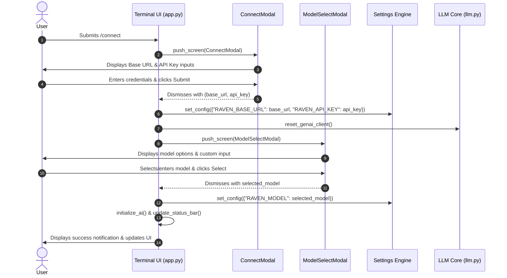

# Specification: `/connect` Dynamic Provider & Model Switcher

## 1. Overview & Objectives

The `/connect` slash command allows users to dynamically configure their LLM provider endpoint (`RAVEN_BASE_URL`), authentication key (`RAVEN_API_KEY`), and target model (`RAVEN_MODEL`) directly within an active Raven terminal session.

### Objectives
- **Zero Configuration Friction:** Enable instant switching between OpenAI-compatible endpoints (e.g., OpenRouter, local Ollama, LM Studio, vLLM, DeepSeek, Google AI endpoints) without restarting the CLI or editing config files manually.
- **Guided Multi-Step Flow:** Provide a smooth two-step modal workflow:
  1. Base URL & API Key input.
  2. Model selection / custom model entry.
- **Session-Level & Persistent State:** Apply changes immediately to the running agent session and persist updated credentials to `~/.raven/config.json`.

---

## 2. User Experience & Workflow



---

## 3. Component Architecture & Interfaces

### 3.1. `ConnectModal` (`agent/terminal_ui/connect_modal.py`)
A Textual `ModalScreen` that collects `base_url` and `api_key`.

- **Result Type:** `tuple[str, str] | None`
- **Fields:**
  - `base_url` (`Input`): Prefilled with current `settings.RAVEN_BASE_URL`.
  - `api_key` (`Input`): Password masked (`password=True`), prefilled with current `settings.RAVEN_API_KEY`.
- **Keyboard Navigation:**
  - `Enter`: Submit credentials if `base_url` is non-empty.
  - `Escape`: Cancel and dismiss without changes (`None`).
  - `Tab` / `Shift+Tab`: Navigate between Base URL, API Key, Submit, and Cancel buttons.

### 3.2. LLM Client Invalidation (`agent/core/llm.py`)
The LLM module maintains a module-level cached client `_genai_client`. When provider settings change, this cache must be invalidated.

- **New Function:**
  ```python
  def reset_genai_client() -> None:
      """Invalidates the cached OpenAI client instance to force re-instantiation with new settings."""
      global _genai_client
      _genai_client = None
  ```

### 3.3. Slash Command Registration & Routing (`agent/terminal_ui/app.py`)
- Register `/connect` in `SLASH_COMMANDS`:
  ```python
  "/connect": {
      "description": "Configure LLM provider endpoint, API key, and model",
      "placeholder": "/connect",
      "system_prompt": ""
  }
  ```
- Add handler methods:
  - `open_connect_modal()`: Opens `ConnectModal`, then triggers `open_model_select_modal()` upon successful credential submission.
  - Chained callback handles settings persistence and AI session reinitialization.

---

## 4. Edge Cases & Error Handling

1. **Empty Base URL**:
   - Prevent submission if Base URL is empty or whitespace-only; display a warning or keep focus on the Base URL input.
2. **Local Endpoints without API Key (e.g., Ollama)**:
   - If `api_key` is left blank, default gracefully to `"ollama"` or dummy token per standard local LLM conventions.
3. **Cancellation mid-flow**:
   - If the user cancels the `ConnectModal` (Esc), abort the flow without altering existing settings.
   - If the user completes `ConnectModal` but cancels `ModelSelectModal`, retain the new Base URL/API Key and keep the currently selected model.
4. **Invalid Endpoint / Connectivity Issues**:
   - `initialize_ai()` safely catches connection test failures and surfaces user-friendly error banners without crashing the TUI.

---

## 5. Implementation Tasks

1. **Create `agent/terminal_ui/connect_modal.py`**:
   - Implement `ConnectModal` layout, Textual inputs, submit/cancel actions, and styling consistent with Raven dark palette.
2. **Update `agent/core/llm.py`**:
   - Add and export `reset_genai_client()`.
3. **Update `agent/terminal_ui/app.py`**:
   - Register `/connect` in `SLASH_COMMANDS`.
   - Implement `open_connect_modal()` with chained callback to `open_model_select_modal()`.
   - Update autocomplete and command submission dispatching.
