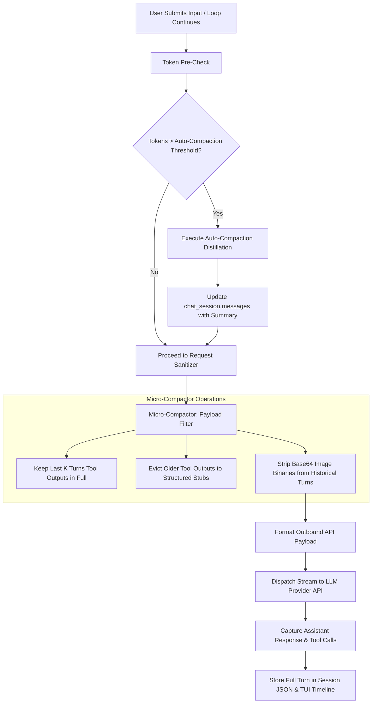

# Specification: Context Pruning & Auto-Compaction System

## 1. Overview & Problem Statement

Raven currently has per-call input/output truncation guards on individual tools:
- `read_file`: paginated to 250 lines by default (capped at 500 lines for large files).
- `execute_command`: truncated to 6,000 characters / 120 lines via `truncate_output`.
- `get_staged_git_changes`: capped at 500 lines.
- `search_file_content`: capped at 20 matches.

However, Raven operates on an **append-only multi-turn message history**:
1. **Unbounded Accumulation Across Turns:** While individual tool calls are capped at ~1,000–1,500 tokens each, 15–20 tool calls across a short conversation still accumulate 25,000–40,000 tokens.
2. **Permanent Historical Deadweight:** A 250-line file read or 6,000-char build log from Turn 1 remains in `self.messages` on Turn 10, Turn 15, and Turn 20, being resent on every single request.
3. **Exponential TTFT & Latency:** Time-To-First-Token and API latency scale as these truncated outputs stack up.
4. **Context Poisoning:** Stale file snapshots from early turns remain in context even after files have been patched or rewritten.
5. **Manual-Only Compaction:** Full summarization only occurs when the user manually runs `/compact`.

### Objectives
- **Micro-Compaction (Cross-Turn Tool Eviction):** Retain the full (per-call truncated) tool outputs only for the active turn ($N$) and previous turn ($N-1$). For turns $\le N-2$, replace the tool output with a lightweight stub in the outbound API request payload while keeping full logs on disk and in the TUI timeline.
- **Autonomous Auto-Compaction:** Trigger background LLM distillation when total prompt tokens exceed a safe ceiling (default: 60,000 tokens or 75% of model threshold).
- **Multimodal Payload Stripping:** Evict large base64 image and binary attachment blocks from historical turns prior to API submission.
- **Strict API Schema Compliance:** Guarantee all tool call / tool response pairs maintain exact `tool_call_id` alignment.

---

## 2. Architecture & Data Flow



---

## 3. Data Schema & Transformation

### 3.1. Tool Output Stubbing Schema
When an older tool response is pruned from the outbound payload, the message structure is strictly maintained, but the payload content is truncated to an informative stub:

```json
{
  "role": "tool",
  "tool_call_id": "call_abc123",
  "name": "read_file",
  "content": "[Output of read_file('agent/terminal_ui/app.py') truncated: 1,450 lines omitted. Action completed in prior turn.]"
}
```

#### Invariant Rules:
1. `role`, `tool_call_id`, and `name` must **never** be deleted, as OpenAI/Gemini/Vertex APIs require 1-to-1 matching with the assistant's `tool_calls`.
2. The user's visual TUI timeline and `~/.raven/sessions/<id>.json` retain the full, unabridged tool output for auditing and inspectability. Pruning only occurs in the transient payload generator (`_prepare_request_messages()`).

### 3.2. Configuration Schema (`agent/core/settings.py`)
Add the following settings with default fallbacks:

```python
# Context management & pruning settings
CONTEXT_PRUNING_ENABLED: bool = True
TOOL_OUTPUT_RETENTION_TURNS: int = 2       # Keep raw tool outputs for last N turns
AUTO_COMPACTION_ENABLED: bool = True
AUTO_COMPACTION_TOKEN_THRESHOLD: int = 60000 # Trigger auto-compaction at 60k tokens
TOOL_OUTPUT_MAX_CHARS: int = 1500          # Max chars for active turn tool outputs
```

---

## 4. Module-by-Module Technical Design

### 4.1. `agent/core/compaction.py`
Add micro-compaction transformation utilities:

* `prune_message_payload(messages: list[dict], retention_turns: int = 2) -> list[dict]`:
  - Scans `messages` in reverse to identify turn boundaries (defined by `user` messages).
  - Flags tool responses occurring before the cutoff threshold.
  - Replaces bulky `content` string with concise stub metadata: tool name, character count saved, and execution summary.
  - Replaces base64 image blocks in non-recent user messages with text placeholders `[Image attachment processed]`.

* `should_auto_compact(current_tokens: int, threshold: int = 60000) -> bool`:
  - Evaluates whether prompt token count exceeds the configured limit.

### 4.2. `agent/core/llm.py` (`AgentChatSession`)
* Modify `send_message_stream()`:
  - Call `prune_message_payload()` during `_sanitize_message_for_api()`.
  - Check `should_auto_compact()`. If triggered, execute `compact_history()` transparently before dispatching the API call.
  - Ensure prompt caching anchors (system prompt and tool definitions) remain invariant at index 0.

### 4.3. `agent/terminal_ui/app.py`
* **Status Bar & Timeline Feedback:**
  - When auto-compaction is triggered, emit a subtle timeline event or status notification: `"Auto-compacting context (exceeded 60k tokens)..."`.
  - Prevent user input lockup by running distillation within the active background worker thread.

---

## 5. Edge Cases & Guardrails

1. **Compaction Loop Prevention:**
   - If auto-compaction fails to reduce tokens below the threshold (e.g., due to an exceptionally large single turn or extreme system prompt), set a flag to prevent infinite re-compaction cycles.
2. **Preserving Critical Constraints:**
   - The system prompt, project memory, and immediate active task instructions must never be pruned or modified by the micro-compactor.
3. **Tool Call ID Integrity:**
   - Every assistant `tool_calls` entry must have an exactly matched `tool` response. Dropping tool messages entirely causes immediate 400 Bad Request errors from LLM providers. Only the `content` field is pruned.
4. **Graceful Fallback:**
   - If distillation fails during auto-compaction, log the warning and fall back to micro-compaction rather than aborting the user's turn.

---

## 6. Implementation Checklist
- [ ] Add context configuration keys to `agent/core/settings.py`.
- [ ] Implement `prune_message_payload` and stub generators in `agent/core/compaction.py`.
- [ ] Integrate payload pruning into `AgentChatSession.send_message_stream` in `agent/core/llm.py`.
- [ ] Implement automatic token threshold monitoring and auto-compaction trigger in `AgentChatSession`.
- [ ] Add visual status cues in `agent/terminal_ui/app.py` during auto-compaction.
- [ ] Verify message integrity, tool call pairing, and persistence against mock sessions.
