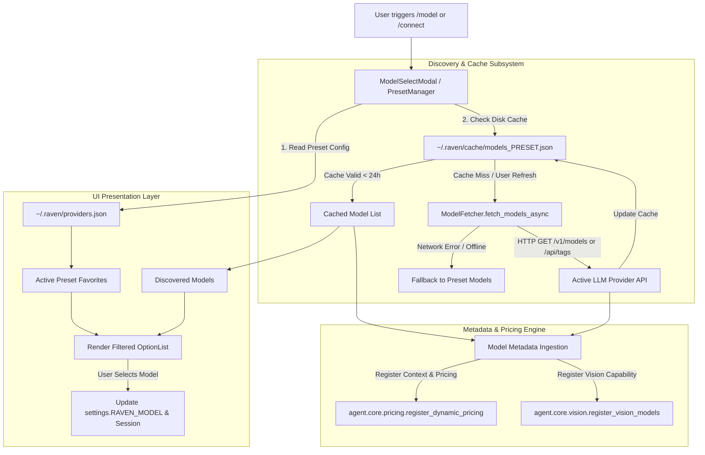

# Specification: Dynamic Provider-Scoped Model Registry & External Configuration

## 1. Overview & Problem Statement

Currently, AI model selection and configuration within Raven suffer from tight coupling and hardcoded static lists:

1. **Hardcoded Model Constants:** `ModelSelectModal` relies on a fixed `DEFAULT_MODELS` list in `agent/terminal_ui/model_select_modal.py` (predominantly OpenRouter/Google model IDs).
2. **Provider Mismatch Friction:** When a user switches provider presets via `/connect` (e.g., to **Local Ollama**, **Groq**, or **Google Vertex AI**), the `/model` selector still presents OpenRouter-specific strings like `google/gemini-3.8-flash` or `nvidia/nemotron-3-super-120b-a12b:free`, which instantly fail if selected.
3. **Static Metadata Isolation:** Pricing (`agent/core/pricing.py`) and vision capability heuristics (`agent/core/vision.py`) are hardcoded dictionaries and regex patterns. When new models are used or configured externally, their context limits, pricing, and capabilities default to generic fallback values ($0 / 128k context) unless code is manually modified.
4. **Configuration Rigidity:** Users cannot easily customize quick-access favorite models outside the codebase without modifying source files.

### Objectives
- **Externalized Provider-Scoped Models:** Store curated favorite and custom models directly in `~/.raven/providers.json` attached to each provider preset.
- **Dynamic Remote Model Discovery (Fetch & Cache):** Automatically query `/v1/models` (OpenRouter, Groq, OpenAI) or `/api/tags` (Local Ollama) asynchronously, with disk-based caching in `~/.raven/cache/` to ensure instantaneous UI rendering and offline resiliency.
- **Dynamic Metadata & Pricing Ingestion:** Parse context length and token pricing directly from discovery payloads (notably OpenRouter `/api/v1/models`) to dynamically enrich `MODEL_PRICING_REGISTRY` at runtime.
- **Context-Aware `/model` UI:** Render provider-specific models with visual badges (`[Vision]`, `[Text]`, `[Preset Favorite]`, `[Discovered]`), active search filtering, and a manual `[Refresh]` discovery action.

---

## 2. Architecture & Data Flow



---

## 3. Data Schemas & File System Layout

### 3.1. `~/.raven/providers.json` (Extended Schema)

Each preset in `providers.json` is extended with `models` (curated favorites/defaults) and an optional `custom_models` array:

```json
{
  "active_preset": "OpenRouter",
  "presets": {
    "OpenRouter": {
      "provider_type": "openai",
      "base_url": "https://openrouter.ai/api/v1",
      "api_key": "sk-or-v1-...",
      "default_model": "anthropic/claude-3.7-sonnet",
      "use_vertex_ai": false,
      "models": [
        "anthropic/claude-3.7-sonnet",
        "google/gemini-2.5-flash",
        "google/gemini-2.5-pro",
        "deepseek/deepseek-r1",
        "meta-llama/llama-3.3-70b-instruct",
        "openrouter/free"
      ]
    },
    "Google Vertex AI": {
      "provider_type": "vertex",
      "base_url": null,
      "api_key": null,
      "default_model": "google/gemini-2.5-flash",
      "use_vertex_ai": true,
      "models": [
        "google/gemini-2.5-flash",
        "google/gemini-2.5-pro",
        "google/gemini-3-flash-preview",
        "google/gemini-3.1-pro-preview"
      ]
    },
    "Local Ollama": {
      "provider_type": "openai",
      "base_url": "http://localhost:11434/v1",
      "api_key": "ollama",
      "default_model": "qwen2.5-coder:14b",
      "use_vertex_ai": false,
      "models": [
        "qwen2.5-coder:14b",
        "deepseek-r1:14b",
        "llama3.3:latest"
      ]
    },
    "Groq": {
      "provider_type": "openai",
      "base_url": "https://api.groq.com/openai/v1",
      "api_key": "gsk_...",
      "default_model": "llama-3.3-70b-versatile",
      "use_vertex_ai": false,
      "models": [
        "llama-3.3-70b-versatile",
        "llama-3.1-8b-instant",
        "mixtral-8x7b-32768",
        "deepseek-r1-distill-llama-70b"
      ]
    }
  }
}
```

### 3.2. Cache Layout: `~/.raven/cache/models_<preset_slug>.json`

Discovered models and their enriched metadata are cached on disk with timestamps:

```json
{
  "preset_name": "OpenRouter",
  "fetched_at": 1740000000.0,
  "ttl_seconds": 86400,
  "models": [
    {
      "id": "anthropic/claude-3.7-sonnet",
      "name": "Anthropic: Claude 3.7 Sonnet",
      "context_limit": 200000,
      "input_cost_per_1m": 3.0,
      "output_cost_per_1m": 15.0,
      "vision": true
    },
    {
      "id": "deepseek/deepseek-r1",
      "name": "DeepSeek: R1",
      "context_limit": 64000,
      "input_cost_per_1m": 0.55,
      "output_cost_per_1m": 2.19,
      "vision": false
    }
  ]
}
```

---

## 4. Component Technical Specifications

### 4.1. Remote Model Fetcher (`agent/core/model_fetcher.py`)

A non-blocking discovery service that handles provider-specific discovery endpoints:

- **OpenRouter Discovery:**
  - Endpoint: `GET https://openrouter.ai/api/v1/models`
  - Headers: `Authorization: Bearer <API_KEY>`
  - Extracts: `id`, `name`, `context_length`, `pricing.prompt` (multiplied by 1M), `pricing.completion` (multiplied by 1M), multimodal modalities.
- **Ollama Discovery:**
  - Endpoint: `GET <base_url_origin>/api/tags`
  - Extracts: `models[].name` (e.g. `qwen2.5-coder:14b`).
- **Standard OpenAI / Groq Discovery:**
  - Endpoint: `GET <base_url>/models`
  - Extracts: `data[].id`.
- **Vertex AI Discovery:**
  - Static fallback to predefined Gemini catalog or custom user models in `providers.json`.
- **Caching Logic:**
  - Cache location: `~/.raven/cache/models_{hash(preset_name)}.json`.
  - Cache TTL: 24 hours. Force refresh bypasses cache.
  - Fail-safe: Returns cached models if available; otherwise returns preset favorite models.

### 4.2. Preset Manager Migration & Accessors (`agent/core/preset_manager.py`)

- **Schema Migration:** Automatically backfill the `models` array for existing presets in `~/.raven/providers.json` without overriding custom user edits.
- **Model Accessors:**
  - `get_preset_models(preset_name: str | None = None) -> list[str]`
  - `add_preset_model(preset_name: str, model_id: str) -> None`
  - `remove_preset_model(preset_name: str, model_id: str) -> bool`

### 4.3. Dynamic Pricing & Metadata Ingestion (`agent/core/pricing.py`)

- Add `register_dynamic_model_pricing(model_id: str, input_cost_per_1m: float, output_cost_per_1m: float, context_limit: int) -> None`:
  - Registers metadata into a memory cache `DYNAMIC_MODEL_PRICING_REGISTRY`.
  - `get_model_pricing()` checks dynamic registry first, falls back to static `MODEL_PRICING_REGISTRY`, then default.

### 4.4. Model Select Modal Enhancements (`agent/terminal_ui/model_select_modal.py`)

- **Provider Header:** Displays active preset name (e.g. `Select Model (OpenRouter)`).
- **Grouped Model List:**
  - **Preset Favorites:** Pinned at the top with a distinct indicator (`★` or `[Favorite]`).
  - **Discovered Models:** Searchable list populated from cache or live fetch.
- **Dynamic Search & Filter:** Typing in the search bar dynamically filters the list in real-time.
- **Async Refresh Button (`[Refresh]`):** Triggers `ModelFetcher` in the background with a spinner/thinking indicator without blocking the Textual UI.
- **Vision Badge Detection:** Live check using cached vision flags or fallback naming heuristics.

---

## 5. Error Handling, Security & Resiliency

1. **Zero UI Blocking:** All network requests for model discovery run asynchronously in background worker threads.
2. **API Key Security:** Discovery requests use the already configured provider credentials in memory; keys are never logged or stored in cache files.
3. **Graceful Network Degradation:** If network timeouts (5s limit), DNS failures, or provider 401/429 errors occur, the UI seamlessly renders preset favorites without throwing unhandled exceptions.
4. **Cache Invalidation:** Changing a preset's `base_url` or `api_key` in `/connect` automatically invalidates that preset's discovery cache.

---

## 6. Implementation Plan & Milestones

- **Phase 1: Preset Schema Migration & Accessors**
  - Update `agent/core/preset_manager.py` with default `models` lists.
  - Implement migration logic for existing `providers.json` configurations.
- **Phase 2: Discovery Engine & Disk Caching**
  - Implement `agent/core/model_fetcher.py` supporting OpenRouter, Ollama, Groq, and standard OpenAI endpoints.
  - Implement disk cache management with TTL and sanitization.
- **Phase 3: Dynamic Metadata Registration**
  - Update `agent/core/pricing.py` and `agent/core/vision.py` to ingest dynamic discovery metadata.
- **Phase 4: TUI Modal Upgrade**
  - Refactor `ModelSelectModal` to consume provider-scoped models.
  - Add search filtering, favorites pinning, vision badges, and async refresh action.
