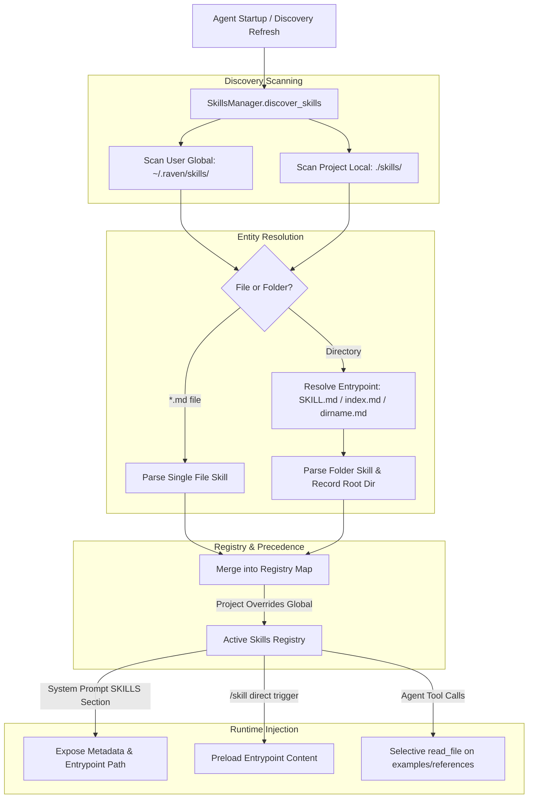

# Specification: Folder-Based Skills Architecture & Multi-File Support

## 1. Overview & Problem Statement

Raven currently discovers skills strictly as standalone markdown files:
- Project scope: `./skills/<name>.md`
- Global scope: `~/.raven/skills/<name>.md`

### Limitations of Single-File Skills
1. **Community Skill Ecosystem Incompatibility:** Emerging AI developer skills (e.g., `delphi-ai/animate-skill`, docx generation toolkits, and Claude Code skill modules) are distributed as multi-file folders containing entrypoints (`SKILL.md`), reference documentation (`references/`), sample code recipes (`examples/`), and utility scripts.
2. **Context Window Inefficiency / Inflexibility:** Large skills forced into a single markdown file either bloat context indiscriminately or omit comprehensive code examples and detailed API references.
3. **Monolithic Maintenance:** Complex skills cannot cleanly isolate templates, TypeScript/Python example files, and domain rules into modular directories.

### Objectives
- **Hybrid Skill Discovery:** Seamlessly discover and support both single-file skills (`skills/<name>.md`) and folder-based skills (`skills/<name>/SKILL.md` or `skills/<name>/index.md`).
- **Progressive Disclosure:** Expose only high-level skill metadata (`name`, `description`, `entrypoint_path`) to the system prompt. Supplementary files (`examples/`, `references/`) are read on-demand by the agent via `read_file` only when needed.
- **Scope & Precedence Preservation:** Local project skills override global skills with the same identifier, whether defined as single files or directories.
- **TUI & Command Compatibility:** Maintain full CRUD capabilities in `SkillsManagerModal`, slash commands (`/skill <name>`, `/<name>`), and safe deletion for both file and folder skill structures.

---

## 2. Architecture & Discovery Workflow



---

## 3. Directory Layout & Skill Anatomy

### 3.1. Supported Layouts

#### Option A: Standalone Single File (Existing format preserved)
```text
skills/
└── frontend.md
```

#### Option B: Multi-File Directory Skill (New format)
```text
skills/
└── animate/
    ├── SKILL.md                 # Primary entrypoint with YAML frontmatter
    ├── references/              # Detailed API docs & constraints
    │   ├── framer-motion.md
    │   └── spring-physics.md
    └── examples/                # Concrete code implementations
        ├── expand-card.tsx
        ├── morphing-tabs.tsx
        └── toast-stack.tsx
```

### 3.2. Entrypoint Resolution Rules

When a directory `skills/<folder_name>` is encountered, `SkillsManager` scans for entrypoint markdown files in this strict priority order:
1. `SKILL.md` (Upper-case standard for Claude Code / community skills)
2. `skill.md` (Lower-case alternative)
3. `index.md` (Standard modular convention)
4. `<folder_name>.md` (Self-named convention)

If no matching entrypoint is found, the directory is safely ignored.

### 3.3. Entrypoint Frontmatter & Context Schema

The entrypoint file contains standard YAML frontmatter:

```markdown
---
name: animate
description: Production-ready React and Framer Motion animation patterns (hardware acceleration, spring physics, layout transitions).
triggers:
  - animation
  - framer motion
  - transition
enabled: true
---

# Animation Guidelines & Principles
...
### Additional References
- For physics configuration: read `references/spring-physics.md`
- For card morphing: read `examples/expand-card.tsx`
```

---

## 4. Component Design & Changes

### 4.1. `agent/core/skills_manager.py`

#### A. Data Model Enhancements
Enhance skill metadata dictionary:
```python
{
    "name": "animate",
    "description": "Production-ready Framer Motion animation patterns...",
    "triggers": ["animation", "framer motion"],
    "enabled": True,
    "scope": "project",           # "global" or "project"
    "skill_type": "folder",       # "file" or "folder"
    "file_path": "skills/animate/SKILL.md",  # Entrypoint path
    "root_dir": "skills/animate", # Skill base folder (or None if file)
    "content": "...",             # Entrypoint body content
    "raw_markdown": "..."         # Raw entrypoint markdown
}
```

#### B. `discover_skills()` Logic
1. Scan `~/.raven/skills/` and `./skills/`.
2. For each path in the directory:
   - If it is a `.md` file: Parse via `parse_skill_file(path, scope)`.
   - If it is a directory: Search for `SKILL.md`, `skill.md`, `index.md`, or `<dirname>.md`. If found, parse entrypoint and record `skill_type="folder"` and `root_dir`.
3. Local project skills overwrite global skills with matching names.

#### C. `delete_skill(name: str)` Logic
- If `skill_type == "folder"`, remove the entire directory recursively via `shutil.rmtree` after safety validation.
- If `skill_type == "file"`, remove the single `.md` file.

#### D. `save_skill(...)` Logic
- Continue defaulting new single-file skills to `<scope_dir>/<name>.md`.
- Provide an optional `as_folder: bool = False` flag to initialize folder-based skills with `SKILL.md`.

---

### 4.2. System Prompt Integration (`agent/main.py` / `agent/core/llm.py`)

The system prompt skill block provides clear guidance on resolving relative paths for folder skills:

```markdown
## SKILL SECTION:

SKILLS:
- Skills are predefined instructions to complete a specific task.
- Below are the available skills. Read the respective skill entrypoint using `read_file`.
- For folder-based skills, reference files or examples relative to the skill's base directory.

---
name: animate
scope: project
type: folder
skill_file_path: skills/animate/SKILL.md
root_dir: skills/animate
description: "Production-ready React and Framer Motion animation patterns..."
---
name: docx
scope: project
type: file
skill_file_path: skills/docx.md
description: "Use this skill any time a .docx file is involved..."
```

---

### 4.3. Interactive TUI Updates (`agent/terminal_ui/skills_modal.py`)

1. **Badge & Details:**
   - Display a visual tag `[DIR]` or `[FILE]` next to the skill name.
   - Show skill folder root and entrypoint file location in detail preview.
2. **Deletion & Editing:**
   - Deleting a folder skill prompts confirmation and removes the folder tree.
   - Editing a folder skill edits its primary entrypoint markdown file (`SKILL.md`).

---

## 5. Security & Path Resolution Constraints

1. **Path Traversal Protection:** Ensure resolved skill root directories and file paths cannot escape outside `~/.raven/skills/` or `<project_root>/skills/`.
2. **Safe Deletion Guards:** Validate that recursive deletion targets strictly reside within authorized skills directories before running `shutil.rmtree`.
3. **No Recursive Multi-Depth Scanning:** Restrict discovery to immediate children under `skills/` (depth = 1) to avoid performance stalls on large repositories.

---

## 6. Implementation Checklist

- [ ] Update `agent/core/skills_manager.py` to discover both files and folder entrypoints (`SKILL.md`, `index.md`, etc.).
- [ ] Add `skill_type` and `root_dir` fields to `SkillsManager` skill dictionaries.
- [ ] Update `agent/core/skills_manager.py` deletion logic to support directory cleanup.
- [ ] Update system prompt formatting in `agent/terminal_ui/app.py` / `agent/main.py` to display folder metadata and root paths.
- [ ] Update `agent/terminal_ui/skills_modal.py` to indicate folder skills and display directory structures.
- [ ] Write deterministic test coverage in workspace verification suite.
