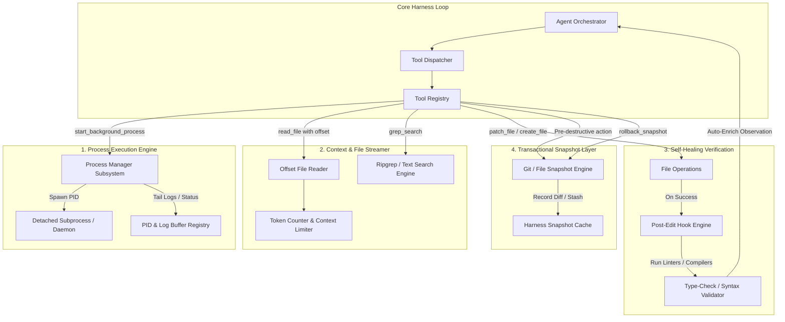

# Specification: Raven Agent Harness Next-Gen Enhancements

## 1. Overview & Objectives

This specification outlines the architectural design, API contracts, and implementation plan for upgrading the **Raven CLI Agent Harness**. 

The goal is to elevate Raven from a prompt-and-patch agent into an autonomous, resilient, and self-healing development runtime. The proposed improvements focus on four critical architectural pillars:

1. **Background Process & Daemon Management:** Allowing long-running commands (dev servers, test runners, watchers) to run without blocking the agent harness or freezing synchronous execution loops.
2. **Chunked & Offset-Aware File Streaming:** Mitigating context window bloat and context rot when interacting with large source files, lockfiles, or extensive logs.
3. **Automated Verification & Self-Healing Hooks:** Providing an automated post-edit feedback loop that executes linting, type-checking, or syntax validation immediately after file modifications.
4. **Safety Checkpoints & Rollback Architecture:** Creating transactional snapshots before potentially destructive terminal operations or batch patches.

---

## 2. System Architecture



---

## 3. Detailed Component Specifications

### Pillar 1: Background Process Management Engine

#### 1.1 Problem Statement
Currently, `execute_command` waits synchronously for a terminal process to terminate. Running servers (`npm run dev`, `python app.py`) or long-running builds causes indefinite hangs, requiring strict negative prompting ("Do NOT run development servers").

#### 1.2 Architectural Design
Create `agent/core/process_manager.py` that maintains a registry of detached or background subprocesses running under Windows (`creationflags=subprocess.CREATE_NEW_PROCESS_GROUP`).

#### 1.3 Tool Definitions

##### Tool: `start_background_process`
- **Parameters:**
  - `command` (`str`, required): The shell command to launch in the background.
  - `process_name` (`str`, optional): A human-readable identifier (e.g., `"frontend-dev-server"`).
  - `working_dir` (`str`, optional): Directory where the command will execute.
- **Output:**
  - `process_id` (`int`): Subprocess PID.
  - `handle` (`str`): Internal identifier key.
  - `initial_output` (`str`): First 2-3 seconds of stdout/stderr logs.

##### Tool: `check_process_status`
- **Parameters:**
  - `process_id` (`int`, optional) or `handle` (`str`, optional): Process identifier.
  - `tail_lines` (`int`, default: 50): Number of stdout/stderr lines to read from the circular log buffer.
- **Output:**
  - `status` (`"running" | "exited" | "failed"`).
  - `exit_code` (`int | None`).
  - `recent_logs` (`str`).

##### Tool: `stop_background_process`
- **Parameters:**
  - `process_id` (`int`) or `handle` (`str`).
  - `force` (`bool`, default: false): Whether to send `SIGKILL` / `taskkill /F`.
- **Output:**
  - Confirmation of process tree termination.

---

### Pillar 2: Large File Chunking & Line-Range Ingestion

#### 2.1 Problem Statement
`read_file` returns the entire content of a file. For large files (over 500 lines, large JSON configs, minified bundles, or `package-lock.json`), this wastes thousands of tokens, introduces noise, and triggers context rot.

#### 2.2 Architectural Design
Update `agent/tools/file_tools.py` to support pagination, line slicing, and an integrated grep utility.

#### 2.3 Tool Updates & New Tools

##### Enhanced Tool: `read_file`
- **Parameters:**
  - `file_path` (`str`, required): Relative or absolute path to the file.
  - `start_line` (`int`, optional, default: 1): Line number to begin reading from (1-indexed).
  - `line_count` (`int`, optional, default: 250): Number of lines to return.
  - `include_line_numbers` (`bool`, default: true): Annotate each returned line with line numbers (e.g., `42 | const x = 10;`) to simplify subsequent `patch_file` operations.
- **Behavior:**
  - If a file exceeds a threshold (e.g., 300 lines) and no `start_line` or `line_count` was supplied, return the first 300 lines accompanied by a clear notice: `"[Showing lines 1-300 of 1,420. Use start_line=301 to read further]"`.

##### New Tool: `search_file_content` (Grep Engine)
- **Parameters:**
  - `query` (`str`, required): Regex pattern or literal string.
  - `file_path` (`str`, optional): Target specific file or search across project workspace.
  - `max_matches` (`int`, default: 20): Maximum matching lines to return with context lines (+/- 2 lines).

---

### Pillar 3: Post-Edit Automated Verification Hooks

#### 3.1 Problem Statement
When the agent executes `patch_file`, it assumes syntactic correctness unless the user asks it to test or the agent manually triggers a terminal command. A silent syntax error or broken import often goes undetected until several turns later.

#### 3.2 Architectural Design
Introduce an opt-in hook system in `agent/tools/file_tools.py` and `agent/core/hook_engine.py`:
- Map file extensions (`.py`, `.ts`, `.tsx`, `.js`, `.json`) to lightweight syntax and validation checkers:
  - Python: `python -m py_compile <file>` or `ruff check <file>`
  - TypeScript/JavaScript: `tsc --noEmit` or quick AST parser check
  - JSON: `json.loads` parsing check
- Upon successful patch application, the hook automatically runs the lightweight linter/syntax validator.
- The validation result is directly appended to the tool result observation:
  ```json
  {
    "status": "success",
    "message": "File patched successfully.",
    "verification": {
      "status": "passed",
      "checker": "py_compile",
      "details": "Syntax valid"
    }
  }
  ```
- If validation fails, the agent immediately receives the exact compilation or syntax error within the same turn, allowing it to perform an immediate self-healing patch.

---

### Pillar 4: Transactional Checkpoints & Rollback Support

#### 4.1 Problem Statement
Destructive terminal commands or multi-file refactoring runs can leave the workspace in a broken intermediate state. Cleaning up requires manual Git maneuvers or agent confusion.

#### 4.2 Architectural Design
Create `agent/tools/checkpoint_tools.py`:
- Before batch operations or upon calling `create_checkpoint`, the harness creates an ephemeral Git stash, temporary branch ref, or staging tree record.
- If an operation fails or the user/agent issues `rollback_checkpoint`, the harness restores the tracked files back to the clean snapshot.

#### 4.3 Tool Definitions

##### Tool: `create_checkpoint`
- **Parameters:**
  - `checkpoint_name` (`str`): Label describing the task boundary (e.g., `"pre-refactor-auth"`).
- **Output:**
  - `checkpoint_id` (`str`): Unique hash.

##### Tool: `rollback_checkpoint`
- **Parameters:**
  - `checkpoint_id` (`str`, optional): Specific checkpoint, or rolls back to the immediate previous checkpoint.
- **Output:**
  - Restored file list and working directory status.

---

## 4. Implementation User Stories

### Story 1: Process Manager & Background Daemons
- **Story ID:** `US-HARNESS-001`
- **Target Files:** `agent/core/process_manager.py`, `agent/tools/miscellaneous_tools.py`
- **Deliverables:**
  - Implement async/non-blocking subprocess launcher supporting Windows process trees.
  - Provide circular log tailing buffer for standard output and standard error.
  - Implement `start_background_process`, `check_process_status`, and `stop_background_process` in tool registry.
  - Guarantee cleanup of running subprocesses when the Raven CLI session terminates.

### Story 2: Paginated File Reading & Search Tools
- **Story ID:** `US-HARNESS-002`
- **Target Files:** `agent/tools/file_tools.py`, `agent/tools/tool_registry.py`
- **Deliverables:**
  - Add `start_line`, `line_count`, and `include_line_numbers` to `read_file`.
  - Add guardrails against reading files larger than 1MB without pagination.
  - Implement regex `search_file_content` (Grep) with line numbering and matched snippet excerpts.

### Story 3: Post-Edit Verification Hook Engine
- **Story ID:** `US-HARNESS-003`
- **Target Files:** `agent/core/hook_engine.py`, `agent/tools/file_tools.py`
- **Deliverables:**
  - Create hook configuration supporting language-specific syntax checks.
  - Integrate hook execution into `patch_file` and `create_file`.
  - Enrich response payloads with verification status without blocking execution on non-fatal warnings.

### Story 4: Transactional State Checkpoints
- **Story ID:** `US-HARNESS-004`
- **Target Files:** `agent/tools/checkpoint_tools.py`, `agent/tools/git_tools.py`
- **Deliverables:**
  - Implement Git stash/tree-based snapshots without clobbering user stashes.
  - Register `create_checkpoint` and `rollback_checkpoint` in `tool_registry.py`.
  - Add automated checkpoint creation before multi-step refactor tasks.

---

## 5. Non-Functional Requirements & Safety Considerations
1. **Windows Compatibility:** All process management must gracefully handle Windows process semantics (`CREATE_NEW_PROCESS_GROUP`, `taskkill /F /T`).
2. **Zero Interactive Hangs:** Any background or verification command must have hard timeouts (e.g., 5000ms max for syntax checks) to prevent freezes.
3. **Token Efficiency:** Line-range reading must reduce average prompt size on file operations by >40% across large repositories.
