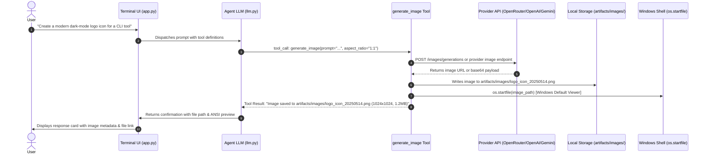

# Specification: Tool-Assisted Image Generation & Artifact Rendering

## 1. Overview & Objectives

Raven is an autonomous developer agent designed for coding, debugging, architecture, and system workflows. Adding native image generation capabilities allows Raven to generate UI mockups, icons, marketing banners, and visual assets directly within developer tasks without disrupting its core LLM reasoning loop.

### Core Architecture Decision: Tool-Assisted vs. Model-Driver
- **Primary Agent Stays LLM**: The active chat model remains a high-reasoning text/multimodal LLM (Gemini 2.5 Flash, Claude 3.5 Sonnet, GPT-4o).
- **Image Generation as a Tool**: Image generation is handled as a structured tool (`generate_image`) executed by the agent, or triggered via a fast slash command (`/imagine <prompt>`).
- **No Heavy Preset Switcher**: Reuses active provider credentials (`RAVEN_API_KEY`, `RAVEN_BASE_URL`) rather than introducing redundant `/connect`-style credential managers for image generation.
- **Context Protection**: Generated binary payloads or base64 streams are strictly written to disk and never fed into conversation history or LLM context windows.

---

## 2. End-to-End Workflow



---

## 3. Configuration & Settings Engine (`agent/core/settings.py`)

A new configuration key `IMAGE_MODEL` is introduced into `Settings` with precedence (`ENV` > `config.json` > Defaults).

```python
# Default Image Model Configurations
DEFAULT_IMAGE_MODEL = "black-forest-labs/flux-1-schnell"

# Settings property
IMAGE_MODEL: str = os.getenv("IMAGE_MODEL", config.get("IMAGE_MODEL", DEFAULT_IMAGE_MODEL))
```

### Curated Default Models per Provider:
- **OpenRouter**: `black-forest-labs/flux-1-schnell`, `black-forest-labs/flux-1-dev`, `recraft-ai/recraft-v3`, `stabilityai/stable-diffusion-3.5-large`
- **OpenAI**: `dall-e-3`, `dall-e-2`
- **Vertex / Gemini**: `imagen-3.0-generate-002`

---

## 4. Tool Implementation: `agent/tools/image_generation_tools.py`

### 4.1. Tool Signature & Schema
```python
def generate_image(
    prompt: str,
    filename: str = "",
    aspect_ratio: str = "1:1",
    model: str = "",
    negative_prompt: str = ""
) -> str:
    """
    Generates an image from a detailed text prompt using the configured image generation model.
    Saves the output file locally in 'artifacts/images/' and opens it in the default viewer.

    Args:
        prompt: Detailed description of the image to generate.
        filename: Optional descriptive base filename (e.g. 'auth_flow_diagram').
        aspect_ratio: Aspect ratio ('1:1', '16:9', '9:16', '4:3', '3:4').
        model: Specific image model to override default IMAGE_MODEL setting.
        negative_prompt: Elements or styles to exclude (if supported by engine).
    """
```

### 4.2. Provider Dispatch Logic

The tool identifies the active provider type from `settings.RAVEN_BASE_URL` or active client instance:

1. **OpenRouter / OpenAI-Compatible Endpoints (`/v1/images/generations` or `/v1/chat/completions`)**:
   - Sends standard POST request with payload:
     ```json
     {
       "model": target_model,
       "prompt": prompt,
       "n": 1,
       "size": "1024x1024",
       "response_format": "b64_json"
     }
     ```
   - Falls back to `url` download if `b64_json` is not returned.

2. **Google GenAI / Vertex AI Endpoints**:
   - Invokes `client.models.generate_images(model='imagen-3.0-generate-002', prompt=prompt, config=...)`.

### 4.3. Artifact Storage & Safety
- Target Directory: `<workspace_root>/artifacts/images/` (created automatically if not present).
- Sanitized Filename: `<clean_name>_<YYYYMMDD_HHMMSS>.<ext>`.
- Context Protection: Returns only metadata and file path to the LLM context. **Never** return raw base64 strings to avoid blowing up context tokens.

---

## 5. Visual Display & TUI Rendering Strategy

### 5.1. Dual Preview System

1. **Native OS Launch (Primary Full-Fidelity Display)**:
   - On Windows: `os.startfile(os.path.abspath(image_path))` automatically opens the generated image in the user's default Windows Photos app or configured editor.
   - Non-blocking execution prevents freezing Textual's event loop.

2. **Inline Terminal Half-Block Thumbnail (Optional TUI Preview)**:
   - Uses `Pillow` to generate a 40-column ANSI half-block (`▀`, `▄`) preview directly inside the chat timeline card.
   - Provides immediate visual confirmation inside the terminal without switching windows.

---

## 6. User Commands & Interactions

### 6.1. Natural Language (Agent-Driven)
The user can ask Raven naturally:
- *"Generate a sleek favicon for our developer documentation."*
- *"Create an architectural conceptual visual for a distributed queue system."*
Raven automatically formulates the optimized prompt, selects aspect ratio, and calls `generate_image`.

### 6.2. Slash Commands
- `/imagine <prompt>`: Fast direct generation bypassing LLM conversation turns. Immediately sends prompt to image generator and saves artifact.
- `/image-model [model_name]`: View or quickly switch the default image model (e.g., `/image-model black-forest-labs/flux-1-dev`).

---

## 7. Error Handling & Edge Cases

| Edge Case / Failure | Handling Strategy |
| :--- | :--- |
| **Provider does not support image generation** | Return clear error message: *"Active provider at `<url>` does not support image generation. Configure an OpenRouter/OpenAI key or switch `IMAGE_MODEL`."* |
| **Content moderation trigger** | Catch API 400/422 safety flags and return human-readable reason to the user. |
| **Network timeout / Slow generation** | Set 60-second timeout on image download; notify user via TUI progress spinner. |
| **Directory write permissions** | Fall back to `~/.raven/artifacts/images/` if project root is read-only. |

---

## 8. Implementation Milestones

1. **Settings & Config Update**: Add `IMAGE_MODEL` to `settings.py` with OpenRouter defaults.
2. **Tool Creation**: Implement `agent/tools/image_generation_tools.py` with OpenRouter, OpenAI, and Imagen adapters.
3. **Tool Registry Integration**: Register `generate_image` in `agent/tools/tool_registry.py` and system prompt schemas.
4. **Thumbnail Generator**: Build lightweight ANSI terminal preview helper using `Pillow`.
5. **Slash Commands**: Implement `/imagine` and `/image-model` in `agent/terminal_ui/slash_commands.py`.
