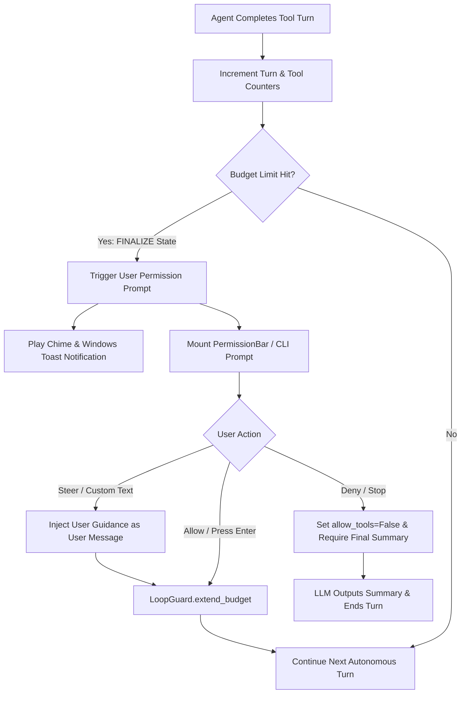

# Specification: Interactive Execution Budget & Loop Continuation

## 1. Overview & Objectives

Currently, when Raven reaches its execution limits (`RAVEN_AGENT_SOFT_TURNS`, `RAVEN_AGENT_HARD_TURNS`, or `RAVEN_AGENT_MAX_TOOL_CALLS`), the agent forcibly transitions to `LoopGuardState.FINALIZE`, blocking further tool calls (`allow_tools = False`) and compelling the LLM to output a final summary.

While this protects against infinite loops, it causes **premature stoppage** during legitimate, complex developer tasks (e.g., broad refactorings, multi-module test-and-fix iterations, or deep codebase audits).

### Key Objectives
1. **Interactive Continuation Checkpoint:** Instead of terminating autonomously, prompt the user via Raven's `PermissionBar` overlay (and CLI prompt) when a limit is reached.
2. **Dynamic Budget Extension:** If granted, extend the agent's turn and tool call ceilings (e.g. +20 turns, +30 tool calls) to allow completion without losing session context.
3. **Mid-Flight Steering:** Allow the user to either approve continuation, deny to force immediate wrap-up, or provide guidance text (e.g., *"stop searching and fix file X"*) to steer subsequent turns.
4. **Persistent Safety Protection:** Retain duplicate tool call interception and stagnation guards so runaway repetitive actions are still halted.

---

## 2. Architecture & Data Flow



---

## 3. Core Subsystem Enhancements

### 3.1. `LoopGuard` Extension API (`agent/core/loop_guard.py`)

Add dynamic budget extension methods to `LoopGuard`:

```python
class LoopGuard:
    def __init__(
        self,
        max_turns: int = 10,
        history_window: int = 4,
        hard_max_turns: int = 20,
        max_tool_calls: int = 40,
        max_no_progress_rounds: int = 3,
        grace_turns: int = 2,
    ):
        ...
        self.extension_count = 0

    def extend_budget(self, extra_turns: int = 20, extra_tools: int = 30) -> None:
        """
        Extends the execution budget when approved by the user.
        Resets the wrap-up state and increases hard ceilings.
        """
        self.hard_max_turns += extra_turns
        self.max_turns += extra_turns
        self.max_tool_calls += extra_tools
        self.wrap_up_started_at = None
        self.no_progress_rounds = 0
        self.extension_count += 1

    def get_checkpoint_prompt(self) -> Tuple[str, str]:
        """Returns the title and message for the user continuation prompt."""
        title = "Execution Budget Checkpoint"
        msg = (
            f"Raven has completed {self.turn_count} turns and {self.tool_call_count} tool calls. "
            f"Continue autonomous execution (+20 turns)?"
        )
        return title, msg
```

---

## 4. User Experience & Interface Handling

### 4.1. Terminal UI Mode (`agent/terminal_ui/app.py`)

1. **Limit Interception:**
   When `loop_guard.get_state() == LoopGuardState.FINALIZE`:
   - Check if this is the first checkpoint trigger for this limit.
   - Trigger desktop chime and notification (`notify_user_action_required`).
   - Display `PermissionBar` above `ChatInput`:
     - **Title:** `"Execution Budget Checkpoint"`
     - **Message:** `"Completed {turn_count} turns & {tool_call_count} tool calls. Continue for +20 turns?"`
     - **Buttons:** `[ Allow (+20 turns) ]` (Green) | `[ Stop & Wrap Up ]` (Red/Slate).
     - **Placeholder:** `"Press Enter to continue, or type steering instructions & Enter..."`

2. **Resolution Handling:**
   - **User clicks "Allow" or hits Enter on empty input:**
     - Calls `loop_guard.extend_budget(extra_turns=20, extra_tools=30)`.
     - Appends timeline status: `"[Budget Extended] +20 turns granted by user."`
     - Autonomous loop resumes immediately with full tool execution.
   - **User clicks "Deny" / "Stop & Wrap Up":**
     - Sets `allow_tools = False`.
     - Injects `loop_guard.get_finalization_instruction()`.
     - LLM generates a concise final summary of work completed and stops.
   - **User types custom steering input and hits Enter:**
     - Calls `loop_guard.extend_budget(extra_turns=20, extra_tools=30)`.
     - Injects the user's text message into the chat session as a steering turn.
     - Autonomous loop resumes with the new instructions prioritized.

---

### 4.2. CLI Mode (`agent/main.py`)

In standard non-TUI terminal execution:
1. When `loop_guard.get_state() == LoopGuardState.FINALIZE`:
   - Print a formatted budget checkpoint:
     ```text
     ⚠️  Execution Budget Checkpoint: 25 turns and 42 tool calls reached.
     Continue autonomous execution for +20 turns? [Y/n/instructions]: 
     ```
   - If user inputs `y`, `Y`, or empty string (`Enter`): extend budget and continue.
   - If user inputs `n` or `N`: finalize without tools.
   - If user inputs custom text: append as steering instruction, extend budget, and continue.

---

## 5. Safeguards & Notification Scoping

1. **Strict Notification Scoping:**
   - Toast notifications and audio chimes (`notify_user_action_required`) must strictly be emitted **only** when the user prompt / `PermissionBar` actually appears on-screen.
   - Never trigger notifications during auto-approved tool executions (e.g. safe `execute_command` or auto-approved commits).
2. **Duplicate Call Guard Remains Active:**
   - Even with extended budgets, duplicate tool calls with identical arguments within the sliding history window will continue to be intercepted.
3. **Stagnation Guard Reset vs. Retention:**
   - Extending the budget resets `no_progress_rounds` to give the agent a fresh opportunity under new instructions or extended turns.
4. **Graceful Cancellation Support:**
   - `Ctrl+C` or the UI `Stop` button immediately sets `cancel_event` and halts execution at any point, whether in a standard turn or after a budget extension.

---

## 6. Implementation Checklist & Test Plan

### Step 1: Subsystem Updates
- [ ] Add `extend_budget()` and `get_checkpoint_prompt()` to `agent/core/loop_guard.py`.
- [ ] Expose `RAVEN_AGENT_EXTENSION_TURNS` (default: 20) in `agent/core/settings.py`.

### Step 2: TUI Loop Controller (`agent/terminal_ui/app.py`)
- [ ] Update autonomous agent worker loop to pause and push `PermissionBar` on `FINALIZE` instead of immediately disabling tools.
- [ ] Handle Allow, Deny, and custom feedback branches.

### Step 3: CLI Mode (`agent/main.py`)
- [ ] Implement interactive terminal prompt on `FINALIZE` state.

### Step 4: Unit & Integration Tests
- [ ] Test `LoopGuard.extend_budget()` resets state from `FINALIZE` back to `CONTINUE`.
- [ ] Test TUI permission resolution extends budget and preserves chat context.
- [ ] Test steering instruction injection when user submits custom text at the checkpoint.
