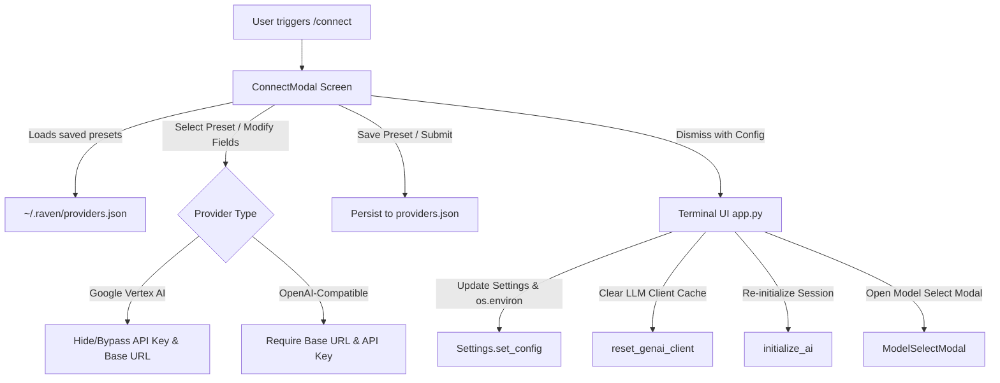

# Specification: Provider Presets & Dynamic Vertex AI Switching (`/connect`)

## 1. Overview & Problem Statement

Currently, switching providers in Raven via `/connect` presents two key developer experience friction points:
1. **Vertex AI Lockout:** `RAVEN_USE_VERTEX_AI` is evaluated globally from environment/settings. When active, `/connect` only captures `RAVEN_BASE_URL` and `RAVEN_API_KEY` and cannot toggle `RAVEN_USE_VERTEX_AI` to `False`. The user must exit the TUI, manually adjust environment variables, and reboot Raven.
2. **Repetitive Credential Entry:** Switching frequently between providers (e.g. OpenRouter, Google Vertex AI, local Ollama, Groq, DeepSeek) forces the user to manually retype lengthy Base URLs and API keys every time.

### Objectives
- **Dynamic Provider Switching (Zero Restarts):** Allow seamless, in-session toggling between Google Vertex AI and standard OpenAI-compatible providers directly through the `/connect` UI.
- **Provider Presets & Profiles:** Enable users to save, manage, and instantly load favorite provider presets (e.g., "OpenRouter", "Vertex AI", "Ollama Local", "Groq").
- **Automatic Field Adaptation:** When "Google Vertex AI" is selected, automatically disable/mask manual API Key and Base URL inputs since Vertex AI uses Google Cloud ADC credentials (`_get_vertex_access_token()`).
- **Atomic Runtime Updates:** Update active `settings`, synchronize `os.environ`, invalidate cached LLM client instances via `reset_genai_client()`, and re-initialize the agent without dropping the active session.

---

## 2. Architecture & Data Flow



---

## 3. Data Schema: `~/.raven/providers.json`

Saved presets are stored in a dedicated configuration file at `~/.raven/providers.json`.

```json
{
  "active_preset": "OpenRouter",
  "presets": {
    "OpenRouter": {
      "provider_type": "openai",
      "base_url": "https://openrouter.ai/api/v1",
      "api_key": "sk-or-v1-...",
      "default_model": "anthropic/claude-3.7-sonnet",
      "use_vertex_ai": false
    },
    "Google Vertex AI": {
      "provider_type": "vertex",
      "base_url": null,
      "api_key": null,
      "default_model": "google/gemini-2.5-flash",
      "use_vertex_ai": true
    },
    "Local Ollama": {
      "provider_type": "openai",
      "base_url": "http://localhost:11434/v1",
      "api_key": "ollama",
      "default_model": "qwen2.5-coder:14b",
      "use_vertex_ai": false
    },
    "Groq": {
      "provider_type": "openai",
      "base_url": "https://api.groq.com/openai/v1",
      "api_key": "gsk_...",
      "default_model": "llama-3.3-70b-versatile",
      "use_vertex_ai": false
    }
  }
}
```

### Preset Manager Helper (`agent/core/preset_manager.py`)
A lightweight helper class will manage reading and writing presets:
- `load_presets() -> dict`
- `save_preset(name: str, config: dict) -> None`
- `delete_preset(name: str) -> None`
- `get_active_preset() -> tuple[str, dict]`

---

## 4. UI / Modal Specifications (`agent/terminal_ui/connect_modal.py`)

### 4.1. Layout & Components
The modal will feature:
1. **Preset Selector (`Select` / List):** Dropdown of saved presets + `"[+ New Custom Provider]"` option.
2. **Provider Type Selector (`RadioSet` or `Select`):** 
   - `OpenAI-Compatible Endpoint`
   - `Google Vertex AI`
3. **Preset Name Input (`Input`):** Editable name for saving/updating presets.
4. **Base URL Input (`Input`):** Dynamic visibility/enabling based on selected provider type.
5. **API Key Input (`Input`, password masked):** Dynamic visibility/enabling based on provider type.
6. **Action Buttons:**
   - `Connect`: Connects using current form parameters.
   - `Save & Connect`: Updates/saves the preset to `providers.json` and connects.
   - `Delete Preset`: Removes current selected preset (if not default/built-in).
   - `Cancel` / `Esc`: Dismisses modal.

### 4.2. Interactive Behavior & State Handling
- When **Google Vertex AI** is selected:
  - Base URL and API Key inputs are disabled (or hidden with placeholder text *"Using Google Cloud ADC authentication"*).
  - Validation requires no Base URL or API Key.
- When **OpenAI-Compatible** is selected:
  - Base URL and API Key inputs are enabled and validated.
- Selecting an item from the **Presets Dropdown** instantly populates all input fields with that preset's stored values.

---

## 5. Runtime & Settings Synchronization

### 5.1. Dynamic In-Memory Configuration
When `ConnectModal` returns a configuration dictionary:
```python
{
    "preset_name": "Google Vertex AI",
    "use_vertex_ai": True,
    "base_url": None,
    "api_key": None,
    "default_model": "google/gemini-2.5-flash"
}
```

`app.py` executes:
```python
# 1. Update settings and sync environment variables
settings.set_config({
    "RAVEN_USE_VERTEX_AI": config["use_vertex_ai"],
    "RAVEN_BASE_URL": config.get("base_url") or "",
    "RAVEN_API_KEY": config.get("api_key") or "",
})

# 2. Invalidate cached OpenAI / Vertex client in llm.py
reset_genai_client()

# 3. Prompt user for model (prefilled with preset's default model) or apply default
# 4. Re-initialize chat session
self.initialize_ai()
```

### 5.2. `agent/core/settings.py` Environment Precedence Patch
To prevent stale `os.environ` variables from overriding dynamic changes made via `settings.set_config()`, `set_config()` will explicitly mirror updates into `os.environ`:
```python
for key, value in config.items():
    if value is None:
        os.environ.pop(key, None)
    else:
        os.environ[key] = str(value)
```

---

## 6. Implementation Steps

1. **Preset Storage Subsystem (`agent/core/preset_manager.py`):**
   - Implement `PresetManager` with default initial presets (OpenRouter, Google Vertex AI, Local Ollama).
   - Implement schema validation and file persistence in `~/.raven/providers.json`.

2. **Revamp `ConnectModal` (`agent/terminal_ui/connect_modal.py`):**
   - Add preset dropdown, provider type toggle, dynamic field toggling, and save/delete controls.
   - Style to match Raven dark theme (`#1e1e1e`, `#06B6D4`, `#10B981`).

3. **Terminal App Controller Integration (`agent/terminal_ui/app.py`):**
   - Update `open_connect_modal()` callback to receive provider type and preset metadata.
   - Chain `ModelSelectModal` with presets' default models.
   - Re-initialize agent and refresh UI status bar with provider details.

4. **Settings & Environment Synchronization (`agent/core/settings.py`):**
   - Ensure `set_config` synchronizes `os.environ` so `use_vertex_ai()` returns accurate runtime state.

5. **Test Suite Additions (`tests/test_provider_presets.py` & `tests/test_connect_modal.py`):**
   - Test preset CRUD operations.
   - Test switching from Vertex AI to OpenAI-compatible and back.
   - Test client cache invalidation and environment variable synchronization.
