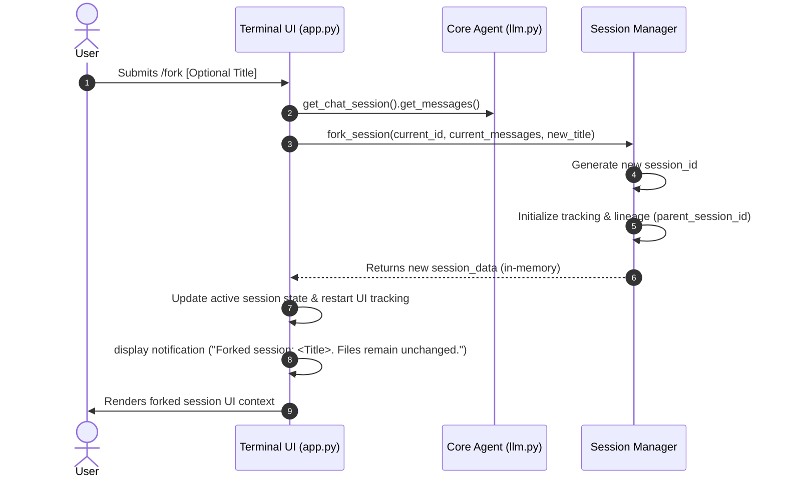

# Specification: `/fork` Session Branching (Version 1: Head Fork)

## 1. Overview & Objectives

The `/fork` slash command allows users to seamlessly branch an active Raven session. It clones the conversational history up to the current moment into a brand new session context. This is highly useful for exploring alternate implementation paths, A/B testing approaches, or swapping models halfway through a complex debugging chain without destroying the original transcript.

### Objectives
- **Data Integrity:** Safely branch a conversation without mutating the original session.
- **Cost Isolation:** Ensure the forked session resets usage tracking so past context tokens and API costs from the parent session aren't double-counted in usage analytics.
- **Waste Prevention:** Adhere to Raven's strict session hygiene by not persisting the newly forked session to disk until the user actually sends their first new message.
- **Lineage Tracking:** Store `parent_session_id` to establish the historical tree.
- **Clear UX:** Visually and explicitly communicate that `/fork` branches conversational memory, **not** the underlying filesystem or git working tree.

---

## 2. User Experience & Workflow



---

## 3. Component Architecture & Interfaces

### 3.1. `agent/core/session_manager.py` Modifications
Add a new method `fork_session()` that handles the deep-copy of conversation state while intentionally resetting usage and timestamp tracking.

```python
def fork_session(
    source_session_data: Dict[str, Any], 
    new_title: Optional[str] = None
) -> Dict[str, Any]:
    """
    Creates a new session in memory branching from an existing session's state.
    
    Args:
        source_session_data: The active session dictionary to fork.
        new_title: Optional custom title for the forked session.
        
    Returns:
        Dict[str, Any]: A new session dictionary with cloned messages and clean analytics.
    """
```
- **Key Logic:**
  - `session_id` = new UUID.
  - `title` = `new_title` or `"Fork of <source_title>"`.
  - `messages` = deep copy of `source_session_data["messages"]`.
  - `parent_session_id` = `source_session_data["session_id"]`.
  - Do **not** call `save_session(force=True)` directly (enforce waste prevention; only save when a user sends a prompt).

### 3.2. `agent/terminal_ui/slash_commands.py` Modifications
Add the `/fork` command mapping to trigger the fork handler.

```python
elif lower_text.startswith("/fork"):
    title_arg = text[5:].strip() or None
    app.action_fork_session(title_arg)
```

### 3.3. `agent/terminal_ui/app.py` Modifications
Add `action_fork_session()` to coordinate the state switch in the UI.

- Fetch the active session data from `get_chat_session()`.
- If no active session, abort gracefully.
- Call `fork_session` from `session_manager.py`.
- **Crucial Step:** Instruct `get_chat_session()` / `llm.py` to reset and initialize a new `AgentChatSession` using the new forked session ID and cloned messages.
- Clear the UI `chat_container` and repopulate it using `load_session_to_ui(new_session_id)`.
- Show a native system notification: `notify("Forked session. Note: Files on disk remain unchanged.")`

### 3.4. Session List UI (`agent/terminal_ui/session_select_modal.py`)
Modify the list items so that if a session has `parent_session_id`, it renders a subtle `[Fork]` badge next to the session title.

---

## 4. Edge Cases & Safeguards

1. **Empty Fork:** If a user runs `/fork` on a brand new empty session, it should handle gracefully (either block it or just clone the empty state).
2. **Double Accounting:** Ensure that when the new session initializes in `llm.py`, it does not pull forward the old session's `UsageTracker` statistics.
3. **Pending Tool Calls:** If the user somehow forks right when a tool call is pending or streaming, the system should strictly reject or block `/fork` until the agent completes its turn.

---

## 5. Development Steps

1. Implement `fork_session` in `session_manager.py`.
2. Add `/fork` routing in `slash_commands.py`.
3. Implement `action_fork_session` logic in `app.py`.
4. Update UI to display the `[Fork]` badge in `session_select_modal.py`.
5. Test to verify `save_session` isn't polluting the `.raven/sessions/` directory with zero-message files immediately upon running `/fork`.