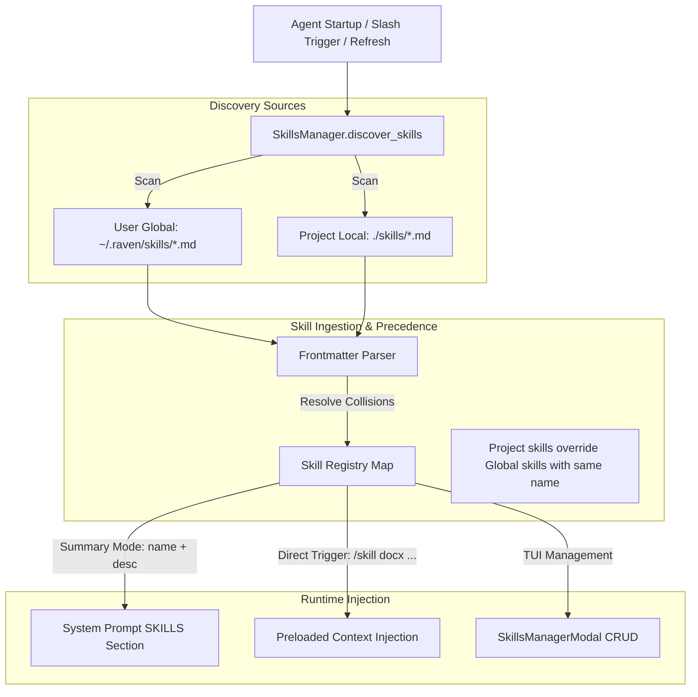

# Specification: Skills System Architecture & Dynamic Discovery

## 1. Overview & Problem Statement

Raven's current skills system relies on a dual-state configuration model:
1. **Split-State Inconsistency (`skills.json` vs `.md`):** Skills require an entry in `skills.json` alongside a file in `skills/<name>.md`. If a user manually drops a `.md` into `skills/`, it is completely ignored. If a file is deleted from the disk, `skills.json` retains a dangling reference.
2. **Project Scope Isolation:** Skills can only be defined within the local project root (`<project>/skills/`). Users cannot define global or personal utility skills (e.g., standard documentation, deployment routines, formatting helpers) in `~/.raven/skills/` to reuse across multiple repositories.
3. **Passive-Only Execution:** Skills are purely passive context hints in the system prompt. The agent must realize it needs a skill, invoke the `read_file` tool call, wait for the response, and then execute the user instruction. Users have no way to directly invoke a skill (e.g., `/skill docx` or `/docx ...`) to preload instructions immediately.
4. **Sub-optimal TUI Experience:** `SkillsManagerModal` is limited to listing and adding skills. It lacks the ability to view skill content, edit instructions, toggle skills on/off, or delete existing skills. Search input also lacks debouncing.

### Objectives
- **Standardize on Self-Contained Frontmatter:** Remove `skills.json`. Every skill is a standalone `.md` file containing YAML/metadata headers at the top.
- **Dual-Scope Skill Discovery:** Support Global (`~/.raven/skills/`) and Project-Local (`<project>/skills/`) discovery directories with clean precedence (local overrides global).
- **Direct Skill Invocation:** Support direct command execution via `/skill <name> [prompt]` and dynamic slash-aliases (`/<skill_name> [prompt]`).
- **Interactive TUI Management:** Overhaul `SkillsManagerModal` into a full CRUD management interface featuring search debouncing, preview/detail viewing, inline editing, and deletion.
- **Graceful Migration:** Automatically migrate existing `skills.json` metadata into the markdown files on startup.

---

## 2. Architecture & Discovery Workflow



---

## 3. Data Schema & Specification

### 3.1. Frontmatter Markdown Format

Every skill file is an ordinary Markdown document prefixed with standard YAML frontmatter:

```markdown
---
name: docx
description: Use when creating, reading, editing Word documents (.docx files) or Word templates.
triggers:
  - docx
  - word doc
  - report
enabled: true
---
# DOCX Creation and Editing Guidelines

Detailed execution instructions for the agent...
```

#### Field Specifications:
| Field | Type | Required | Description |
| :--- | :--- | :--- | :--- |
| `name` | string | Yes | Lowercase alphanumeric identifier (e.g., `docx`, `fastapi_scaffold`). Defaults to filename stem if omitted. |
| `description` | string | Yes | Detailed description of capabilities and activation conditions. |
| `triggers` | list[str] | No | Optional keywords/phrases that hint high relevance for auto-invocation. |
| `enabled` | boolean | No | Defaults to `true`. If `false`, omitted from prompt and autocomplete. |

### 3.2. Directory Precedence & Scope

Raven scans the following paths in order:
1. **User Global Scope:** `~/.raven/skills/*.md`
2. **Project Local Scope:** `<project_root>/skills/*.md`

If a skill named `frontend` exists in both scopes, the **Project Local** skill takes precedence.

---

## 4. Component Design & Changes

### 4.1. `agent/core/skills_manager.py` (Core Engine)

Refactor `skills_manager.py` to eliminate `skills.json`:
- **`parse_skill_file(path: Path, scope: str) -> dict | None`**:
  - Zero-dependency frontmatter parser using regex (`^---\s*\n(.*?)\n---\s*\n(.*)$` with `re.DOTALL`).
  - Extracts frontmatter key-values (`name`, `description`, `enabled`, `triggers`).
  - Returns metadata dictionary with `scope` (`"global"` or `"project"`), `file_path`, `content`, and `raw_markdown`.
- **`discover_skills() -> list[dict]`**:
  - Scans both `~/.raven/skills/` and `<project_root>/skills/`.
  - Merges into a dictionary keyed by `name` (project overrides global).
  - Returns active list of skills.
- **`save_skill(name: str, description: str, content: str, scope: str = "project", enabled: bool = True) -> dict`**:
  - Writes standard Markdown file with frontmatter into the target scope directory.
- **`delete_skill(name: str, scope: str = "project") -> bool`**:
  - Deletes the `.md` file from the corresponding scope directory.
- **`toggle_skill(name: str, enabled: bool) -> bool`**:
  - Rewrites frontmatter with updated `enabled` status without altering instructions.
- **`migrate_legacy_skills_json()`**:
  - If `skills.json` exists, reads metadata, merges descriptions into respective markdown headers, and safely renames `skills.json` to `skills.json.bak`.

### 4.2. Runtime Injection & Direct Skill Invocation

#### A. Progressive Disclosure (System Prompt)
`build_skills_prompt_section()` generates a compact summary for all enabled skills:
```markdown
SKILLS:
- Predefined task instructions. Read respective file using `read_file` when triggered.
---
name: docx
scope: project
skill_file_path: skills/docx.md
description: "Use when creating, reading, editing Word documents..."
```

#### B. Direct Invocation (`/skill` and Slash Aliasing)
Allow users to directly trigger skills without agent guessing:
- **Syntax:** `/skill <name> <optional prompt>` or `/<skill_name> <optional prompt>` (e.g., `/docx create quarterly report`).
- **Execution Mechanism in `app.py`:**
  - On submit, if command matches a known skill:
    1. Loads the target skill markdown body.
    2. Injects it into the immediate user turn as a prioritized context prompt:
       ```markdown
       [SYSTEM INSTRUCTION: The user has explicitly invoked the '{name}' skill.]
       ---
       {skill_content}
       ---
       User Request: {prompt}
       ```
    3. Prevents unnecessary tool-call round-trips for `read_file`.

### 4.3. TUI Interface Overhaul (`agent/terminal_ui/skills_modal.py`)

Upgrade `SkillsManagerModal` into a dual-pane or split action manager:
- **Search Bar with Debouncing:**
  - Implements Textual timer-based debouncing (200ms) on `on_input_changed`.
- **Visual Badges in OptionList:**
  - Scope badge: `[Global]` vs `[Project]`
  - Status indicator: `[Enabled]` (green) vs `[Disabled]` (dim grey)
- **Modal Controls & Keybindings:**
  - `c`: Open `CreateSkillModal` (allows selecting Global vs Project target).
  - `e` / `Enter`: Open `SkillDetailModal` to preview or edit instructions in a full `TextArea`.
  - `Space`: Toggle enable/disable status.
  - `d` / `Delete`: Delete skill (prompts confirmation).
  - `Esc`: Close modal.

---

## 5. Implementation Plan

| Phase | Tasks | Target Files |
| :--- | :--- | :--- |
| **Phase 1: Parser & Discovery** | - Implement zero-dependency YAML frontmatter parser.<br>- Implement global and local directory scanning.<br>- Add legacy migration utility. | `agent/core/skills_manager.py` |
| **Phase 2: Direct Invocation** | - Register dynamic slash commands for skills in `slash_commands.py`.<br>- Add `/skill <name>` handling in `app.py` to preload instructions. | `agent/terminal_ui/slash_commands.py`<br>`agent/terminal_ui/app.py` |
| **Phase 3: TUI Overhaul** | - Add debounced search to `skills_modal.py`.<br>- Add preview, inline editor, toggle, and delete actions.<br>- Update `styles/skills_modal.tcss`. | `agent/terminal_ui/skills_modal.py`<br>`agent/terminal_ui/styles/skills_modal.tcss` |
| **Phase 4: Backward Compatibility & Migration** | - Migrate existing `skills/docx.md`, `frontend.md`, and `pptx.md` to frontmatter.<br>- Verify all existing skills load seamlessly. | `skills/*.md`<br>`skills/skills.json` |

---

## 6. Verification & Safety

1. **Deterministic Migration:** Ensure existing skills metadata in `skills.json` is preserved without losing markdown content.
2. **Path Sanitization:** Enforce path validation to prevent path traversal outside designated global/project skills directories.
3. **No External Dependencies:** Frontmatter parsing must not introduce heavy dependencies (no PyYAML requirement).
