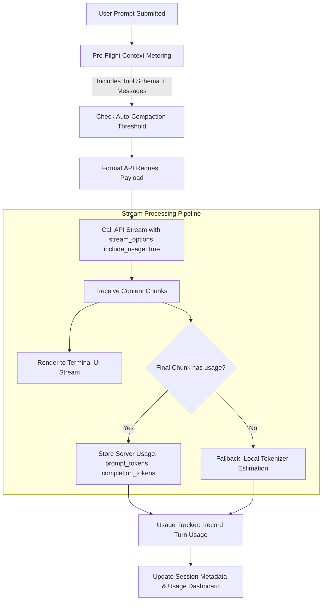

# Specification: Token Tracking Accuracy & Server Usage Extraction

## 1. Overview & Problem Statement

Raven currently tracks prompt and completion tokens locally using a client-side tokenizer estimation (`count_tokens()` in `agent/core/token_counter.py`). This introduces significant discrepancies with actual billed tokens, particularly for GCP Vertex AI and other non-OpenAI endpoints:

1. **Missing Server-Side Usage Stream Capture:** Both OpenAI and Vertex AI (via OpenAI-compatible endpoints) provide exact usage metrics (`prompt_tokens`, `completion_tokens`, `total_tokens`) in the terminal streaming chunk when `stream_options={"include_usage": True}` is supplied. Raven currently does not request or parse this final usage chunk.
2. **Ignored Tool Schema Overhead:** Raven attaches the full tool definitions array (`raven_tools`) to every request (~12,000 characters / ~3,000 tokens). Raven's local counter only evaluates `self.messages`, ignoring tool definitions and leading to consistent undercounting of input tokens.
3. **Tokenizer Mismatch:** Vertex AI Gemini models employ a 256,000-vocabulary SentencePiece tokenizer. In contrast, Raven relies on `tiktoken` (cl100k_base / o200k_base) or falls back to a 4-character heuristic (`len(text) // 4`) when `tiktoken` is not installed, causing 15% to 40% drift on code and structured JSON.
4. **Missing Runtime Dependency:** `tiktoken` was not listed in `pyproject.toml`, forcing default execution into character-based division heuristics.

### Objectives
- **Exact Server-Side Accounting:** Capture provider-reported usage directly from the response stream to achieve 100% token tracking accuracy across all supported providers (GCP Vertex AI, OpenAI, OpenRouter, Groq).
- **Graceful Fallback:** Maintain local token estimation only for pre-flight context checks (e.g. auto-compaction triggers, sidebar meter) and when upstream providers do not emit usage metadata.
- **Accurate Pre-Flight Estimation:** Factor in tool schema definitions and install `tiktoken` as a formal project dependency.

---

## 2. Architecture & Data Flow



---

## 3. Detailed Technical Design

### 3.1. Stream Usage Extraction (`agent/core/llm.py`)

#### Request Configuration
In `send_message_stream()`:
- When dispatching requests via `client.chat.completions.create(...)`, pass `stream_options={"include_usage": True}`.

#### Chunk Extraction
In `_wrap_stream()` generator:
- Track stream completion and inspect the final chunk for `chunk.usage`.
- If `chunk.usage` is present, store the dictionary in `self._last_usage`:
  ```python
  self._last_usage = {
      "prompt_tokens": chunk.usage.prompt_tokens,
      "completion_tokens": chunk.usage.completion_tokens,
      "total_tokens": chunk.usage.total_tokens,
  }
  ```

#### Usage Recording
In `record_turn_usage(assistant_response)`:
- Check if `self._last_usage` is populated for the completed turn:
  - If present: Extract `prompt_tokens` and `completion_tokens` from `self._last_usage` directly.
  - If absent: Fall back to `count_tokens(self.messages, self.model_name)` and `count_tokens(assistant_response, self.model_name)`.
- Reset `self._last_usage = None` after recording.

---

### 3.2. Pre-Flight Tool Schema Accounting (`agent/core/token_counter.py`)

To ensure sidebar context indicators and auto-compaction triggers reflect real wire usage before dispatch:
- Add a helper function `get_tools_token_count(tools, model_name)` that serializes the tool registry schema and returns its estimated token weight.
- Integrate tool token overhead into `get_context_usage()`.

---

### 3.3. Dependency Management (`pyproject.toml`)

- Add `tiktoken>=0.7.0` to the project dependencies list in `pyproject.toml` so local estimations utilize byte-pair encoding when offline or before receiving server stream headers.

---

## 4. Verification & Validation Plan

1. **Streaming Usage Validation:**
   - Verify that streaming responses from Vertex AI and OpenAI return `chunk.usage` at stream conclusion.
   - Assert `record_turn_usage` receives the exact server values instead of estimated counts.

2. **Zero-Drift Cost Comparison:**
   - Run benchmark multi-turn conversations and verify that session token totals match GCP Cloud Monitoring metrics exactly.

3. **Fallback Resiliency:**
   - Simulate a provider that omits `chunk.usage` and ensure Raven falls back cleanly to local tokenizer estimation without exceptions.
