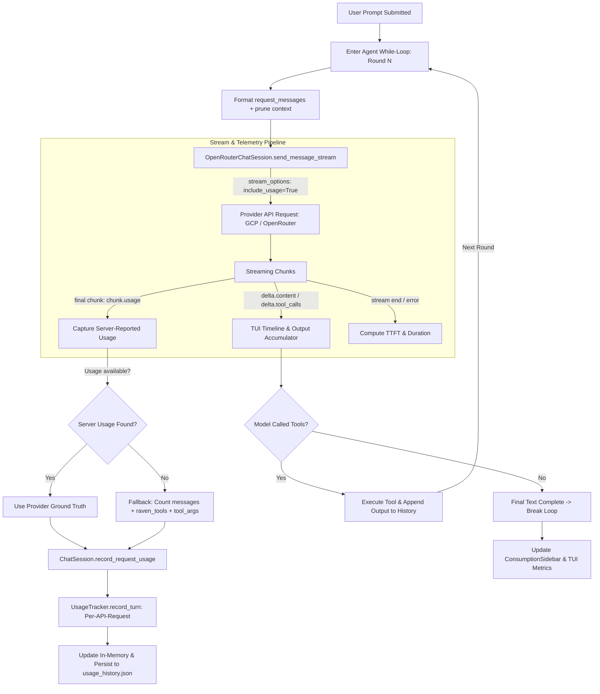

# Specification: Accurate Token Tracking & API Usage Accounting Subsystem

## 1. Overview & Problem Statement

### 1.1. Context & Discrepancy
In production telemetry (e.g., Google Cloud Platform / Vertex AI usage dashboards), token consumption for autonomous agent workflows shows discrepancies of up to **100x** compared to Raven's internal tracking (`~/.raven/usage_history.json`).

For example, on single heavy development days (e.g., `gemini-3.8-flash` on Oct 6–7):
- **GCP Ground Truth:** ~5.1M input tokens, ~125k output tokens across scores of individual API calls.
- **Raven's Internal Tracker:** 28,617 input tokens, 448 output tokens, and only 1 recorded request.

### 1.2. Root Cause Analysis
Raven's token tracking subsystem suffers from five compounding architectural gaps:

1. **Loop-Level Accounting Blindspot:**
   In `agent/terminal_ui/app.py`, an agentic turn executes inside a `while True` loop that invokes `send_message_stream` multiple times (one for each tool-execution step). However, `self.chat_session.record_turn_usage(...)` is called **only once** at the exit of the entire loop. Intermediate calls are completely discarded, losing hundreds of thousands of cumulative input tokens.
2. **Missing System Tool Schemas Overhead:**
   Every API call passes all 15 tool definitions (`raven_tools`) in `request_args["tools"]`, consuming **~3,022 input tokens per call**. Raven's token counter only evaluates `self.messages`, ignoring tool schemas completely.
3. **Completion Token Omission on Tool Arguments:**
   When the LLM outputs tool invocations, the payload is contained in `delta.tool_calls` (arguments JSON), while `delta.content` is empty. Raven only accumulated `delta.content` into `total_text_response` for token counting, recording **0 completion tokens** for intermediate tool calls.
4. **Ignored Server-Side Usage Telemetry:**
   OpenAI and Vertex AI endpoints do not return stream usage metrics by default unless `stream_options={"include_usage": True}` is explicitly passed. Furthermore, Raven's stream processor skips chunks where `chunk.choices` is empty (`if not chunk.choices: continue`), discarding the final usage chunk sent by the provider.
5. **Tokenizer Divergence:**
   Raven uses OpenAI's `tiktoken` (`cl100k_base` / `o200k_base`) or a naive 4-characters-per-token heuristic. When calling Google Gemini models (which use a 256k SentencePiece BPE tokenizer), client-side estimation diverges from server-side tokenization.

---

## 2. Architectural Design & Telemetry Flow



---

## 3. Detailed Component Specifications

### 3.1. Provider-Native Usage Ingestion (`agent/core/llm.py`)

#### A. Enable Stream Usage in Request Payload
Update `send_message_stream` to request usage from the provider:
```python
request_args = {
    "model": self.model_name,
    "messages": request_messages,
    "stream": True,
    "stream_options": {"include_usage": True},
}
if allow_tools:
    request_args["tools"] = raven_tools
```
*Note:* Some third-party or legacy providers return a 400 error if `stream_options` is passed. The implementation must handle this gracefully: if a 400 error occurs with `"stream_options"`, retry once without `stream_options` and fall back to local estimation.

#### B. Stream Wrapper Telemetry Interception (`_wrap_stream`)
`_wrap_stream` must intercept and store the final chunk's usage object:
```python
self._last_server_usage = None

for chunk in response:
    if not ttft_recorded and (getattr(chunk, "choices", None) or getattr(chunk, "usage", None)):
        ttft_ms = (time.perf_counter() - start_time) * 1000.0
        ttft_recorded = True
    
    if getattr(chunk, "usage", None) is not None:
        u = chunk.usage
        self._last_server_usage = {
            "prompt_tokens": getattr(u, "prompt_tokens", 0) or 0,
            "completion_tokens": getattr(u, "completion_tokens", 0) or 0,
            "total_tokens": getattr(u, "total_tokens", 0) or 0,
        }
    yield chunk
```

#### C. Dedicated Request-Level Accounting Method
Add `record_request_usage` on `OpenRouterChatSession` to be invoked on every LLM round:
```python
def record_request_usage(
    self,
    round_messages: list,
    round_text: str = "",
    round_tool_calls: list = None,
    allow_tools: bool = True,
    duration_ms: float = 0.0,
    ttft_ms: Optional[float] = None,
    status: str = "success",
    error_code: Optional[str] = None
) -> Dict[str, Any]:
    """
    Records usage for a single API HTTP request.
    Prioritizes provider server-reported usage over heuristic estimation.
    """
    server_usage = getattr(self, "_last_server_usage", None)
    
    if server_usage and (server_usage["prompt_tokens"] > 0 or server_usage["completion_tokens"] > 0):
        prompt_tokens = server_usage["prompt_tokens"]
        completion_tokens = server_usage["completion_tokens"]
    else:
        # Client-side fallback calculation
        prompt_tokens = count_tokens(round_messages, self.model_name)
        if allow_tools:
            from agent.tools.tool_registry import raven_tools
            prompt_tokens += count_tokens(raven_tools, self.model_name)
            
        completion_tokens = count_tokens(round_text, self.model_name)
        if round_tool_calls:
            for tc in round_tool_calls:
                fn_args = tc.get("function", {}).get("arguments", "")
                fn_name = tc.get("function", {}).get("name", "")
                completion_tokens += count_tokens(f"{fn_name}:{fn_args}", self.model_name)

    summary = self.tracker.record_turn(
        prompt_tokens=prompt_tokens,
        completion_tokens=completion_tokens,
        model_name=self.model_name,
        duration_ms=duration_ms,
        ttft_ms=ttft_ms,
        status=status,
        error_code=error_code,
    )
    self.get_context_usage()
    self.save_session_state()
    return summary
```

---

### 3.2. Execution Loop Integration (`agent/terminal_ui/app.py` & `agent/main.py`)

#### A. Turn-Level Usage Capture in `run_generation_stream`
Move usage recording **inside the `while True` loop** right after generator consumption:
```python
# In agent/terminal_ui/app.py -> run_generation_stream:
while True:
    round_start = time.perf_counter()
    # ... stream consumption ...
    
    # Record usage for THIS specific LLM API request
    round_dur_ms = getattr(self.chat_session, "_last_duration_ms", 0.0)
    round_ttft_ms = getattr(self.chat_session, "_last_ttft_ms", None)
    
    last_summary = self.chat_session.record_request_usage(
        round_messages=request_messages,
        round_text=round_text,
        round_tool_calls=assistant_tool_calls,
        allow_tools=allow_tools,
        duration_ms=round_dur_ms,
        ttft_ms=round_ttft_ms,
        status="success"
    )
    
    # Update sidebar live after each sub-turn
    self.update_sidebar_metrics(last_summary)
    
    if not function_calls:
        break
    
    # ... tool execution and history appending ...
```

#### B. Accurate Handling of Empty Choice Chunks
Modify the stream reading loop:
```python
for chunk in generator:
    if self.cancel_event.is_set():
        break
    # Do not skip chunk if it has usage information
    if not chunk.choices:
        continue
    # ... process delta ...
```

---

### 3.3. Token Counter Refinements (`agent/core/token_counter.py`)

1. **Tool Schema Serializer:** Add `count_tools_tokens(tools: list, model_name: str) -> int` to cache the serialized token overhead of `raven_tools` rather than re-serializing on every request.
2. **Multimodal and Tool Call Estimation:** Ensure JSON serialization overhead and message role markers are accounted for uniformly.

---

### 3.4. Metrics Aggregation & Sidebar Compatibility (`agent/core/usage_tracker.py`)

1. **Request Count Integrity:**
   Every call to `record_turn` increments the `requests` count. By recording per API call, `requests` in `usage_history.json` will accurately match the request graph in GCP / OpenRouter (rather than only counting 1 request per user conversation turn).
2. **Sidebar Metric Smoothness:**
   The `ConsumptionSidebar` in the TUI will display live incremental token usage updating after every tool call round, giving immediate visual feedback of token consumption while long multi-tool tasks run.

---

## 4. Verification & Validation Plan

| Test / Check | Expected Outcome |
| :--- | :--- |
| **Stream Usage Capture** | Verify `_last_server_usage` is populated from `chunk.usage` when calling Vertex AI / Gemini. |
| **Multi-Turn Tool Task** | Running a task requiring 3 tool executions results in 3 increments to `requests` and sums all 3 prompt/completion payloads. |
| **Tool Schema Accounting** | Even on fallback estimation, `count_tools_tokens` (~3,000 tokens) is included in input tokens for every request. |
| **Tool Arguments in Completion** | File patches or command arguments generated by the model are fully counted in `completion_tokens`. |
| **Legacy Provider Compatibility** | If an API rejects `stream_options`, the request retries cleanly without failing the user interaction. |
| **GCP Alignment Check** | Daily token sums in `~/.raven/usage_history.json` align within <1% variance of GCP Vertex AI analytics. |
