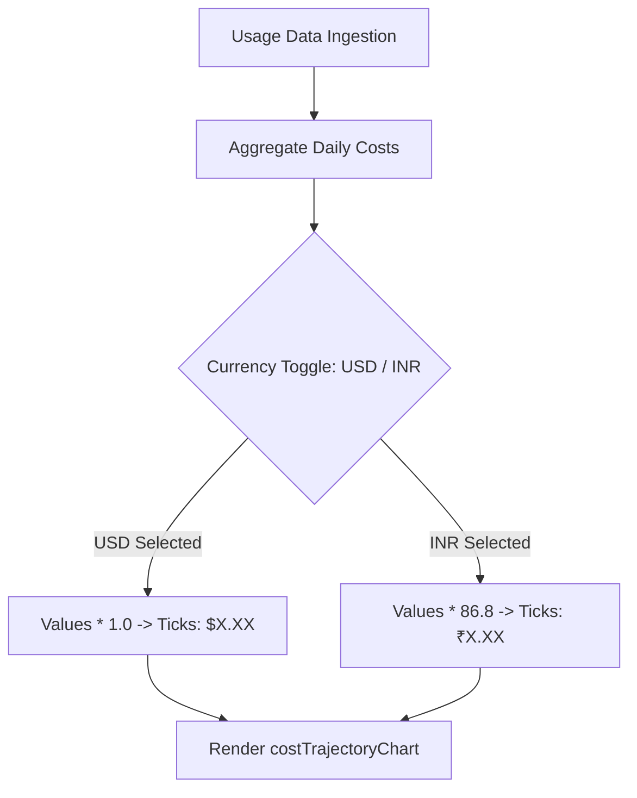

# Specification: Usage Dashboard UI Enhancements

## 1. Overview & Problem Statement

The HTML analytics dashboard (`~/.raven/usage_report.html`, generated via `agent/core/usage_html_template.py`) provides valuable usage telemetry, but requires key visual and analytical refinements:

1. **Unbounded Date View on Token Consumption:** The "Daily Token Consumption per Model" chart currently renders all historic dates horizontally without bounds, crowding the x-axis. It lacks range filtering (e.g., 7 days vs 30 days).
2. **Visual Clutter & Collision in Token Chart:** 
   - The total token trend line passes directly through the top edge of the stacked bars (since line data = sum of bars), creating visual collisions.
   - The line's filled background area renders in front of or awkwardly across the stacked bars.
   - Default Chart.js category padding leaves gaps on the extreme left and right margins rather than anchoring edge-to-edge.
3. **Low-Value Request Volume Chart:** The "Daily Request Volume" bar chart is largely redundant with the telemetry table. Replacing it with a dedicated **Daily Total Cost Trajectory** line chart provides direct financial visibility, with the ability to toggle between US Dollars ($) and Indian Rupees (₹).

---

## 2. Technical Requirements

### 2.1. Daily Token Consumption per Model (`tokensChart`)

#### A. Range Picker & 7-Day Default
- **Default Window:** Display the **last 7 calendar days** (or last 7 recorded activity dates) by default.
- **Range Control:** Add a pill-style segmented selector or dropdown directly in the chart card header:
  - Options: `Last 7 Days` (default active), `Last 14 Days`, `Last 30 Days`, `All Time`.
- **Filtering Logic:**
  - Maintain a global state variable `tokenDateRange = '7d'`.
  - Slice or filter the dates array passed to `tokensChart` without mutating the data for other sections.

#### B. Line Elevation Above Stacked Bars
- **Offset Calculation:**
  - When calculating the line dataset values, apply a visual clearance multiplier:
    ```javascript
    const ELEVATION_FACTOR = 1.08; // 8% visual clearance above highest bar stack
    const elevatedLineData = dailyTotals.map(val => val > 0 ? Math.round(val * ELEVATION_FACTOR) : 0);
    ```
- **Tooltip Integrity:**
  - Override the line dataset tooltip label callback so it displays the **true total tokens** (`dailyTotals[context.dataIndex]`), never the inflated rendering coordinate.

#### C. Layer Ordering (Area Behind Bars)
- In Chart.js, rendering order is controlled via the `order` property (higher `order` renders behind lower `order`):
  - Stacked Bar Datasets: `order: 1`
  - Total Trend Line & Area Fill: `order: 2`
  - Result: The glowing line and its semi-transparent gradient area are painted **behind** the crisp stacked model bars.

#### D. Edge-to-Edge Bar & Point Positioning
- Disable default categorical margins so the first date aligns with the left axis border and the last date aligns with the right axis border:
  ```javascript
  scales: {
      x: {
          offset: false,
          grid: { offset: false, display: false }
      }
  }
  ```

---

### 2.2. Cost Trajectory Chart (`costTrajectoryChart`)

#### A. Removal of Request Volume Chart
- Completely remove `<canvas id="requestsChart"></canvas>` and the corresponding Chart.js initialization logic.

#### B. New Daily Cost Trajectory Chart Specification
- **Card Title:** `💰 Daily Cost Trajectory`
- **Chart Type:** `line` with smooth spline interpolation (`tension: 0.35`) and filled gradient background (`fill: true`).
- **Data Series:** Daily aggregated cost across all models for each date.

#### C. Currency Switching (USD $ vs INR ₹)
- **Currency Control:** Segmented toggle buttons in the card header:
  - `[$ USD]` (active by default) | `[₹ INR]`
- **Conversion Factor:** `const USD_TO_INR = 86.8;`
- **Dynamic Formatting:**
  - **State:** `let costCurrency = 'USD'; // 'USD' | 'INR'`
  - **Y-Axis Ticks:**
    - USD: Format with `$` prefix (e.g., `$0.05`, `$1.20`).
    - INR: Format with `₹` prefix (e.g., `₹4.34`, `₹104.16`).
  - **Tooltip:**
    - Formats daily value with the selected currency symbol and 4 decimal places (or 2 decimal places for INR).



---

## 3. Detailed UI & CSS Modifications

### 3.1. Card Header Controls Layout
In `agent/core/usage_html_template.py`, chart cards will feature flexbox headers with inline controls:

```html
<!-- Token Consumption Card Header -->
<div class="chart-card-header">
    <div class="chart-title">📊 Daily Token Consumption per Model</div>
    <div class="btn-group btn-group-sm">
        <button id="btn-tokens-7d" class="btn-toggle active" onclick="setTokenRange('7d')">7D</button>
        <button id="btn-tokens-14d" class="btn-toggle" onclick="setTokenRange('14d')">14D</button>
        <button id="btn-tokens-30d" class="btn-toggle" onclick="setTokenRange('30d')">30D</button>
        <button id="btn-tokens-all" class="btn-toggle" onclick="setTokenRange('all')">All</button>
    </div>
</div>

<!-- Cost Trajectory Card Header -->
<div class="chart-card-header">
    <div class="chart-title">💰 Daily Cost Trajectory</div>
    <div class="btn-group btn-group-sm">
        <button id="btn-cost-usd" class="btn-toggle active" onclick="setCostCurrency('USD')">$ USD</button>
        <button id="btn-cost-inr" class="btn-toggle" onclick="setCostCurrency('INR')">₹ INR</button>
    </div>
</div>
```

### 3.2. CSS Additions
```css
.chart-card-header {
    display: flex;
    justify-content: space-between;
    align-items: center;
    margin-bottom: 1rem;
}
.btn-group-sm .btn-toggle {
    padding: 0.25rem 0.6rem;
    font-size: 0.75rem;
}
```

---

## 4. Implementation Steps in `agent/core/usage_html_template.py`

1. **Update State Variables:**
   - Add `let tokenDateRange = '7d';`
   - Add `let costCurrency = 'USD';`
2. **Implement Control Handlers:**
   - `function setTokenRange(range)`: updates active UI button, slices date window, updates `tokensChart`.
   - `function setCostCurrency(currency)`: updates active currency button, recalculates datasets/ticks, updates `costTrajectoryChart`.
3. **Refactor `tokensChart` Generation:**
   - Filter `dates` to selected range.
   - Set `offset: false` on `scales.x`.
   - Set `order: 2` on line dataset, `order: 1` on bar datasets.
   - Elevate line coordinates by 8%, custom tooltip displaying raw token count.
4. **Replace `requestsChart` with `costTrajectoryChart`:**
   - Replace canvas markup.
   - Build daily cost calculation and dataset with gradient fill.
   - Configure dynamic scales and tooltip formatting for USD/INR.
5. **Regenerate & Test Template:**
   - Ensure existing usage history renders properly without console errors.

---

## 5. Verification & Acceptance Criteria

- [ ] **7-Day Default:** Opening `/usage` renders only the last 7 activity dates in the Token Consumption chart by default.
- [ ] **Range Switching:** Switching between `7D`, `14D`, `30D`, and `All` instantaneously updates the chart and bars without full-page reload.
- [ ] **No Bar Collision:** The trend line sits comfortably above the stacked bars, and the area fill is visually layered behind all bars.
- [ ] **Edge Alignment:** The first bar starts flush on the left border, and the last bar ends flush on the right border.
- [ ] **Cost Trajectory Chart:** The request volume chart is gone. The cost trajectory line chart accurately reflects total daily spend.
- [ ] **Currency Toggle:** Toggling `$ USD` and `₹ INR` re-scales the Y-axis and tooltips with the 86.8 conversion rate immediately.
