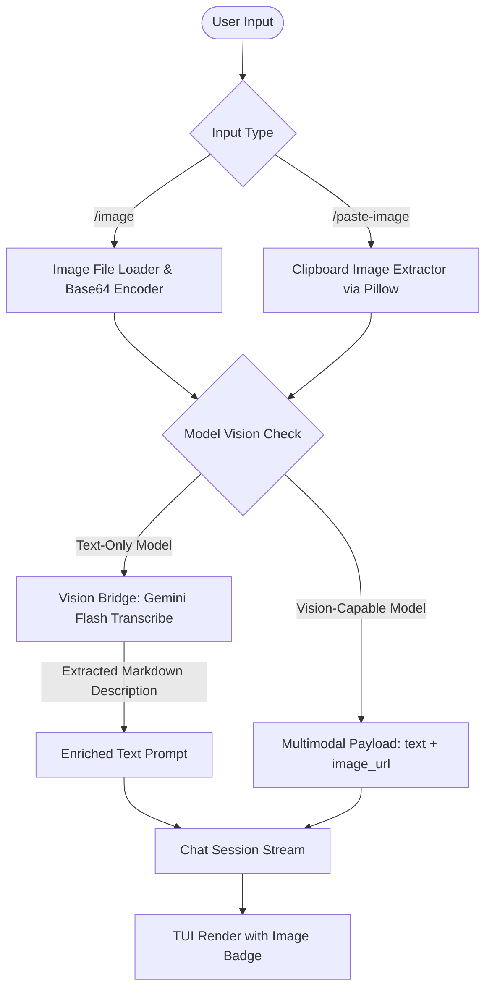

# Epic: Multimodal Image Support & Vision Bridge

## Epic Overview
Enable Raven to process image inputs (screenshots, diagrams, error messages, UI mockups) alongside user queries within its Textual Terminal User Interface. 

Because Raven supports diverse LLMs (some vision-capable, some text-only), this feature includes pre-flight capability checks, an optional "Vision Bridge" for transcribing visual data for text-only models, zero-friction clipboard paste (`/paste-image`), file path ingestion (`/image`), and safe multimodal token counting.

---

## Architecture & Implementation Plan

---

## User Stories

### Story 1: Image Ingestion, Validation & Base64 Encoding
**ID:** `US-IMAGE-001`  
**Priority:** High  
**Status:** Completed  

#### Description
As a user, I want Raven to load image files from disk or grab screenshots directly from my system clipboard and convert them to valid base64 data URIs so that models can ingest them.

#### Acceptance Criteria
1. **File Ingestion:** Implement `encode_image_file(file_path: str) -> dict` in `agent/utils.py` supporting `.png`, `.jpg`, `.jpeg`, `.webp`, `.gif`.
2. **Clipboard Ingestion:** Implement `grab_clipboard_image() -> dict | None` using `PIL.ImageGrab` to extract screenshots taken with `Win + Shift + S` directly from memory.
3. **Validation & Limits:** Enforce maximum image size limits (e.g., 10MB) and throw user-friendly error messages if a file does not exist, has an invalid extension, or if the clipboard contains no image.
4. **Unit Tests:** Add comprehensive unit tests in `tests/test_image_utils.py` covering file encoding, MIME type detection, clipboard handling, and invalid file paths.

---

### Story 2: Model Vision Capability Detection & Vision Bridge
**ID:** `US-IMAGE-002`  
**Priority:** High  
**Status:** Completed  

#### Description
As an agent runtime, I want to detect whether the active model supports multimodal vision and provide a fallback "Vision Bridge" if the user has selected a text-only model.

#### Acceptance Criteria
1. **Vision Capability Detection:** Implement `is_model_vision_capable(model_name: str) -> bool` using known model families (Gemini, GPT-4o, Claude 3/3.5, Pixtral, Qwen-VL, LLaVA).
2. **Vision Bridge Fallback:** Implement a helper function `transcribe_image_with_vision_model(image_data_uri: str, query: str = "") -> str` that queries a lightweight vision model (e.g., `google/gemini-2.5-flash` or default provider) to extract text, code snippets, and UI layout into Markdown.
3. **Model Selection Badges:** In `ModelSelectModal`, annotate available models with `[Vision]` or `[Text]` so users know capabilities at a glance.
4. **Unit Tests:** Add unit tests in `tests/test_vision_capability.py` verifying keyword heuristics and bridge invocation mocking.

---

### Story 3: Multimodal Session Serialization & Token Accounting
**ID:** `US-IMAGE-003`  
**Priority:** High  
**Status:** Completed  

#### Description
As a conversation manager, I want `AgentChatSession` to support OpenAI standard multimodal message structures (`content: [{"type": "text", ...}, {"type": "image_url", ...}]`) without breaking session persistence, title generation, or token counting.

#### Acceptance Criteria
1. **Multimodal Message Support:** Update `AgentChatSession.send_message_stream`, `commit_user_message`, and `save_session_state` to support `content` as either a `str` or `list` of content blocks.
2. **Session Title Guard:** Ensure automatic session titling extracts plain text from multimodal content blocks without inserting base64 strings into titles.
3. **Token Counter Protection:** In `agent/core/token_counter.py`, avoid counting millions of characters for raw base64 image strings. Instead, estimate a fixed tile cost (~1,000 tokens per image).
4. **Unit Tests:** Add unit tests in `tests/test_multimodal_session.py` covering message commitment, token estimation, and JSON persistence.

---

### Story 4: Terminal UI Integration (`/image` and `/paste-image`)
**ID:** `US-IMAGE-004`  
**Priority:** High  
**Status:** Completed  

#### Description
As a user in the Textual TUI, I want dedicated slash commands (`/image` and `/paste-image`) with autocompletion and visual badges in chat history cards so I can easily ask questions about screenshots and diagrams.

#### Acceptance Criteria
1. **Slash Commands:** Register `/image <file_path> <query>` and `/paste-image <optional_query>` in `SLASH_COMMANDS` with autocompletion.
2. **Chat Input Handler:** In `agent/terminal_ui/app.py`, handle image commands in `on_chat_input_submitted`:
   - Encode file or grab clipboard image.
   - If model is text-only, prompt user or execute vision bridge.
   - Stream response cleanly.
3. **Chat Message Rendering:** Update `ChatMessageWidget` in `agent/terminal_ui/chat_message.py` to display an image badge (e.g., `[🖼️ Image: diagram.png]` or `[🖼️ Clipboard Image]`) above or beside the user query in the chat history.
4. **Error Interception:** Safely catch API 400 errors related to multimodal incompatibility and display an informative error card without crashing the UI.
5. **End-to-End Verification:** Manual & automated tests for TUI command processing and rendering.
